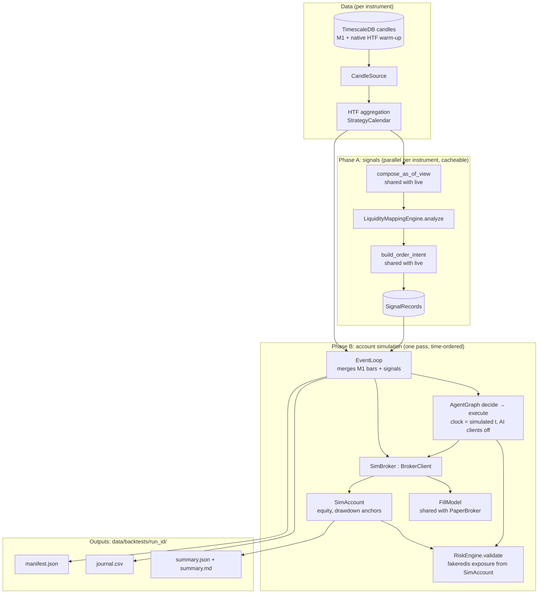

# Design Document

**Spec**: AlgoBacktester
**Requirements**: `.kiro/specs/algo-backtester/requirements.md` 

## Overview

AlgoBacktester replays M1 history through the live decision path and simulates the resulting orders with a conservative, cost-aware fill model. Its correctness rests on three design choices:

1. **Shared code, not copies.** Each piece of logic that both live and backtest need moves into one module that both import:
   - the as-of candle view
   - the setup-to-order logic
   - the fill model
   - instrument specs

   The backtester then drives the real `AgentGraph` (decide → execute) against a simulated broker, so risk gating, confidence floors and execution guards are the live ones.
2. **Two phases.** Phase A, signal generation, is pure and depends only on candles, so it runs per instrument, in parallel, and is cacheable. Phase B, account simulation, is stateful and runs once, in strict time order across all instruments. It applies the rules that span the whole account: one trade per instrument, concurrent-trade limit and drawdown.
3. **Time is injected everywhere.** Nothing on the decision or fill path reads the wall clock during a backtest. Every component that today calls `datetime.now()` on that path takes a clock.

### Changes to existing live code

These are deliberate, small, and each is covered by its own task:

| # | Change | Why | Requirement |
|---|---|---|---|
| L1 | Extract setup-to-order logic from `scripts/run_live_agent.py` into `agent/order_intent.py`, and its constants into `agent/strategy_config.py` | One implementation for live and backtest | 1.2, 1.6 |
| L2 | `setup_id` becomes deterministic, derived from the entry PD array's id (new `SetupGradeDetail.entry_array_id`) instead of `uuid4()` | Re-grading the same array yields the same id: needed for D6 (one attempt per setup) and for duplicate-order protection | 1.3, D6 |
| L3 | Live runner builds its candle window with `compose_as_of_view()`: closed entry-TF bars, and HTF bars on the strategy calendar (aggregated from H1 where the broker's native bars follow a different clock) | Live evaluates exactly what the backtest replays, at any broker | 2.7, D5, D9 |
| L4 | `PaperBrokerAdapter` delegates fills to `agent/brokers/fill_model.py` and takes an injectable clock | One fill model; parity with backtests | 4.1, 4.2, D4 |
| L5 | `AgentGraph`, `observe_node`, `learn_node` and `log_agent_decision` accept a clock (default: wall clock) | `observe_node`'s 60-second staleness check reads `datetime.now()` and would reject every replayed setup | 2.5 |
| L6 | `scripts/load_historical_data_mt5.py` stores each bar's spread, in price units | Cost model | 3.5, 5.1 |
| L7 | Delete `ml/backtesting/engine.py` and `backend/tests/test_backtesting_engine.py` | Superseded | — |
| L8 | Broker profiles: `agent/broker_profiles.py` + `config/brokers/<profile>.toml`. The spec export script and MT5 history loader take `--profile` | Any broker without code changes; credentials stay in `.env` | 10 |

---

## Architecture



### Package layout

```
agent/
  order_intent.py          # NEW (L1): build_order_intent(), OrderIntent, NoTrade
  strategy_config.py       # NEW (L1): StrategyConfig (windows, min R:R, grade→confidence, expiry rule)
  instruments.py           # NEW: InstrumentSpec, tick value conversion, spec loading
  broker_profiles.py       # NEW (L8): BrokerProfile, credential resolution from .env, symbol map
  brokers/fill_model.py    # NEW (L4): FillModel, Bar, SimOrder, FillEvent
  brokers/paper.py         # CHANGED (L4): delegates to FillModel, injectable clock
  graph.py, nodes/*.py     # CHANGED (L5): clock injection
services/market_data/
  strategy_calendar.py     # NEW: StrategyCalendar — New York-close period boundaries per TF (D9)
  as_of_view.py            # NEW (L3): aggregate(), compose_as_of_view()
config/
  brokers/<profile>.toml   # NEW (L8): venue, credential env-var names, server clock, symbol map, spec file
  instruments/<profile>.toml  # per-broker specs + costs, exported (e.g. exness-standard.toml, binance.toml)
  backtests/base.toml      # NEW: base run configuration + named variants
algo_backtester/           # NEW package (backtest-only; not shipped in the paper-trader image)
  config.py                # RunConfig, StudyConfig, variant resolution
  data.py                  # CandleSource (TimescaleSource, CsvSource), coverage check, fingerprint
  signals.py               # Phase A
  cache.py                 # Phase A cache
  sim_broker.py            # SimBroker(BrokerClient): sizing, costs, FillModel
  account.py               # SimAccount: equity, drawdown anchors, exposure for RiskEngine
  simulation.py            # Phase B event loop
  metrics.py               # summary statistics, bootstrap CI, breakdowns
  report.py                # manifest / journal / summary writers
  compare.py               # side-by-side comparison of runs
  report_html.py           # self-contained HTML run report (Req 11)
  __main__.py              # CLI: run | compare | check-data
scripts/
  export_instrument_specs.py    # NEW: venue specs + measured costs → config/instruments/<profile>.toml
  export_forward_test_fixture.py # NEW: forward-test period → parity fixture
  run_fx_forward_test.ps1        # NEW: Exness FX/gold paper forward test on the Windows host (Req 9.6)
```

Tests follow the existing convention for engine and agent code: `backend/tests/test_backtest_*.py`, with fixtures under `backend/tests/fixtures/backtester/`. `data/backtests/` is added to `.gitignore`.

---

## Components and Interfaces

### StrategyCalendar (`services/market_data/strategy_calendar.py`)

Defines where every strategy candle starts, the same for all brokers and venues (D9, Req 3.3). The engine therefore sees identical candles whether the data came from a UTC server, a New York-close server or Binance.

```python
class StrategyCalendar:
    def period_start(self, t: datetime, tf: Timeframe) -> datetime: ...   # UTC in, UTC out
    def period_end(self, t: datetime, tf: Timeframe) -> datetime: ...
    def matches_native(self, clock: MT5ServerClock | None, tf: Timeframe) -> bool: ...
```

- Floor the instant in **New York wall time shifted by +7 h**, then convert back to UTC. This is the same rule as an MT5 `ny_close` server clock, so DST is handled by `zoneinfo`.
  - D1 starts at 17:00 New York.
  - W1 starts at Saturday 17:00 New York: the `ny_close` server's Sunday 00:00, the label MT5 gives weekly bars. The FX week (Sunday 17:00 open to Friday 17:00 close) falls inside it.
  - On US DST-change days, boundaries map to their first real occurrence. A period running into New York's repeated hour absorbs it, so periods tile time with no gaps or overlaps, which matters for crypto.
  - H1–H12 floor to multiples of their length from the 17:00 day start. H3, H4, H6, H8 and H12 all divide 24 hours, so they nest inside D1. H4 starts at 17:00, 21:00, 01:00, 05:00, 09:00 and 13:00 New York.
- `matches_native` reports where a venue's native bars can be used directly:
  - every TF for an MT5 `ny_close` server;
  - H1 and below for a whole-hour UTC offset (e.g. Exness, UTC+0) and for Binance.

### As-of view (`services/market_data/as_of_view.py`)

```python
def aggregate(bars: Sequence[Candle], tf: Timeframe, calendar: StrategyCalendar) -> list[Candle]:
    """Closed-period OHLCV bars of `tf` built from finer bars (M1 in backtests)."""

def compose_as_of_view(
    closed: Mapping[Timeframe, Sequence[Candle]],  # closed bars per TF, oldest first
    recent_m1: Sequence[Candle],                   # M1 bars covering the largest in-progress HTF period
    t: datetime,
    entry_tf: Timeframe,
    windows: Mapping[Timeframe, int],              # StrategyConfig.candle_counts
    calendar: StrategyCalendar,
) -> dict[Timeframe, list[Candle]]:
```

Rules, matching Req 2.1–2.4:
- A bar is *closed at t* when `bar.timestamp + duration(tf) <= t`. This uses M1 close times, never open times.
- **Entry timeframe and below:** the last `windows[tf]` closed bars.
- **Higher timeframes:** the last `windows[tf] - 1` closed bars, plus one in-progress bar. The in-progress bar is aggregated from `recent_m1` bars that start at or after `calendar.period_start(t, tf)` and closed at or before `t`. If no such M1 bar exists yet, there is no in-progress bar and the window holds `windows[tf]` closed bars.
- The function is pure: no I/O and no clock.

**How each side supplies its inputs:**
- **Backtest:** `closed` comes from `aggregate()` over stored M1. Where M1 history starts after the warm-up a window needs (W1 × 30 is about 30 weeks), it falls back to the stored native HTF bars, and the manifest records the warm-up source per TF.
- **Live (L3):** for each TF where `calendar.matches_native(...)`, `closed` is the venue's native bars with the forming bar dropped. Other TFs are aggregated from native H1 bars (D1 × 90 needs about 2,200 H1 bars; W1 × 30 about 5,000). `recent_m1` is fetched to cover the current W1 period (about 7,200 M1 bars at most: one MT5 call, or 8 Binance requests).
- **Equivalence:** the aggregation-parity test (Req 3.4) is what makes native and aggregated closed bars interchangeable wherever `matches_native` is true.

### StrategyConfig (`agent/strategy_config.py`)

A frozen Pydantic model that holds what is now scattered through `run_live_agent.py`:
- `entry_tf` and `context_tfs` (H12, H8, H6, H4, H3)
- `candle_counts` (today's `_CANDLE_COUNT`)
- `min_rr` (default 3.0)
- `grade_confidence` (A+ 0.90, A 0.80, B 0.70)
- `tp_levels` (2.5, 4.0)
- `pending_expiry`: `KILLZONE_END` or `FIXED_TTL`, with `fallback_ttl_minutes` 180 (the TTL under `FIXED_TTL`, and outside every killzone under `KILLZONE_END`)

`fingerprint()` hashes the model's canonical JSON. Grader parameters stay in `liquidity_engine` and enter the manifest through the engine code fingerprint.

### Order intent (`agent/order_intent.py`)

```python
@dataclass(frozen=True)
class OrderIntent:
    setup_id: str; instrument: str; entry_tf: Timeframe; as_of: datetime
    grade: SetupGrade; direction: Literal["LONG", "SHORT"]
    entry: float; stop_loss: float; take_profit_1: float; take_profit_2: float | None
    r_ratio: float; confidence: float
    time_features: TimeFeatures; patterns: tuple[dict, ...]; regime: str
    def to_message(self, mode: AgentMode) -> dict: ...   # the AgentGraph message the runner builds today

@dataclass(frozen=True)
class NoTrade:
    instrument: str; as_of: datetime; grade: str; reason: str   # NO_GRADE | NO_TRADE | RR_BELOW_MIN
    detail: str = ""; r_ratio: float | None = None              # grader's reason / R:R shortfall, for logs and the journal

def build_order_intent(liquidity_map, view, instrument, as_of, cfg: StrategyConfig) -> OrderIntent | NoTrade:
```

It is a move of `_process_instrument` lines 447–509 with behaviour unchanged, apart from the deterministic `setup_id` (L2):

```python
setup_id = deterministic_id("setup", instrument, cfg.entry_tf.value, grade_detail.entry_array_id)
```

Both the live runner and Phase A call this function, so Req 1.3 holds by construction. A test also asserts it by running the refactored runner path and Phase A on the same fixture view.

`to_message()` omits `candles_by_tf`. Without it, `observe_node` doesn't run the engine a second time. That second run is redundant today (the runner already analysed), and the AI layers that consume its output are disabled in backtests anyway.

`to_message(mode, detected_at=None)` stamps `detected_at`, which `observe_node`'s 60 s staleness check measures from. It defaults to `as_of`: a backtest detects at t. Live, data is as of the last bar close but detection happens when the runner evaluates, so the runner passes the hand-off time.

### InstrumentSpec (`agent/instruments.py`, `config/instruments/*.toml`)

```python
@dataclass(frozen=True)
class InstrumentSpec:
    symbol: str; venue: Literal["mt5", "binance"]
    point: float; tick_size: float; contract_size: float
    volume_min: float; volume_step: float; volume_max: float
    base_ccy: str; quote_ccy: str
    default_spread: float                  # price units: typical spread, floors each bar's recorded spread (Req 5.1, D10)
    commission: CommissionSpec             # PER_LOT_PER_SIDE (MT5) | RATE_PER_SIDE (Binance, 0.001)
    stop_slippage: float                   # D3 amended, price units: 25% of default_spread, min 2 points; crypto 0.05% of export-time price

def money_per_price_unit(spec, price: float, conversion: float | None, account_ccy="USD") -> float:
```

- Value of a one-price-unit move for one lot, in account currency:
  - quote = USD: `contract_size`
  - base = USD (USDJPY, USDCAD): `contract_size / price`
  - crosses: multiply by `conversion`, the quote→USD rate at that time, taken from the conversion pair's M1 series. That pair must be present in the store, or the run refuses the instrument (Req 3.6 coverage check).
- `scripts/export_instrument_specs.py` writes one spec file per broker profile. Three rules:
  - **Commission (D2):** total `|commission| + |fee|` over recent deals ÷ total traded volume. This is correct whether the broker splits commission across entry and exit or charges the round trip on entry.
  - **Typical spread:** median ask − bid over 72 h of ticks.
  - **Refusal:** it writes nothing while a value is missing or zero, or while our money-per-tick disagrees with the broker's `trade_tick_value`.

### BrokerProfile (`agent/broker_profiles.py`, `config/brokers/<profile>.toml`)

```toml
# config/brokers/exness-standard.toml
venue = "mt5"
spec_file = "config/instruments/exness-standard.toml"
server_clock = "+0"                 # verified against live ticks on connect (Req 10.6)
[credentials]                        # names of .env variables, never values (Req 10.2)
login = "MT5_LOGIN"
password = "MT5_PASSWORD"
server = "MT5_SERVER"
[symbols]                            # instrument -> broker symbol
EURUSD = "EURUSDm"
XAUUSD = "XAUUSDm"
```

`load_profile(name)` returns the venue, the resolved credentials (read from the environment at call time), an `MT5ServerClock`, the symbol map and the `InstrumentSpecs`. Instruments missing from `[symbols]` map to themselves. The export script and MT5 history loader take `--profile` (Req 10.5).

A profile without `spec_file` is **data-only**: a candle source that is never priced or traded. `metaquotes-demo` is one, the New York-close reference server for the aggregation-parity test (task 186), since that demo reports zero spreads. `connect_mt5(profile, attach=True)` uses the account the terminal is already logged into instead of logging in; the clock check still runs, and it is what confirms the terminal is on that broker.

### FillModel (`agent/brokers/fill_model.py`)

A pure state machine shared by `PaperBrokerAdapter` and `SimBroker` (Req 4.1).

```python
@dataclass(frozen=True)
class Bar:            # one M1 bar; prices are BID (MT5 convention)
    timestamp: datetime; open: float; high: float; low: float; close: float
    spread: float     # price units, max(recorded, spec.default_spread) (Req 5.1); ask = bid + spread

@dataclass
class SimOrder:
    order_id: str; setup_id: str; instrument: str; direction: Literal["LONG", "SHORT"]
    kind: Literal["MARKET", "LIMIT"]; entry: float; stop: float; target: float | None
    placed_at: datetime; expires_at: datetime | None
    status: Literal["PENDING", "OPEN", "CLOSED"]
    ideal_fill: float | None; fill: float | None          # ideal = before spread/slippage
    ideal_exit: float | None; exit: float | None; exit_reason: str | None
    filled_at: datetime | None; closed_at: datetime | None
    mae_price: float | None; mfe_price: float | None

class FillModel:
    def __init__(self, stop_slippage: float): ...   # price units, from InstrumentSpec.stop_slippage
    def step(self, order: SimOrder, bar: Bar) -> list[FillEvent]:   # mutates order; returns FILLED/SL/TP/EXPIRED/REJECTED events
```

Rules, implementing Req 4. Throughout, `ask = bid + spread`.

| Rule | Behaviour |
|---|---|
| Eligibility | Only bars with `timestamp >= placed_at` are considered. |
| Market entry (4.3) | Fills at the next bar's open: ask for LONG, bid for SHORT. `ideal_fill` = bid open. |
| Limit entry (4.4) | LONG fills when `low + spread < entry`, at `entry`. SHORT fills when `high > entry`, at `entry`. Strict inequality: a touch is not a fill. |
| Expiry (4.10) | PENDING and `bar.timestamp >= expires_at` gives EXPIRED. No bars exist while the venue is closed, so nothing fills then (4.11), and an order expiring over a weekend expires on the first bar after reopening. |
| Stop (4.5–4.7) | LONG triggers when bid `low <= stop`. SHORT triggers when ask `high + spread >= stop`. Exit price is `stop`, or the bar open if the bar opened beyond the stop (gap), then worsened by `stop_slippage`. |
| Target (4.5) | LONG exits when bid `high >= target`. SHORT exits when ask `low + spread <= target`. Exit at `target`, no slippage (it is a resting limit). |
| Same bar (4.8) | Stop and target both reachable: stop wins. |
| Fill bar (4.9) | On the bar a limit fills, a stop-out may occur; a target exit may not. |
| Excursions (4.12) | `mae_price` / `mfe_price` update on every bar while OPEN, using the side that would close the position: bid for LONG, ask for SHORT. |
| Invalid stops | A MARKET order whose fill price is already beyond its stop or target is REJECTED (`INVALID_STOPS`), as a broker rejects invalid stops. |

Settled while building it (task 194):
- **Ideal vs actual prices.** `ideal_fill` / `ideal_exit` are the bid at that moment, before slippage; `fill` / `exit` are on the executing side (ask for buys) plus slippage. A trade pays the spread once, on its buy: a LONG limit fills at `entry` with `ideal_fill = entry - spread`; a SHORT stop exits at `stop` with `ideal_exit = stop - spread`. Gross R uses ideal prices, net R actual ones.
- **Fill bar.** Req 4.9 applies to LIMIT fills. A MARKET fill happens at the open, before the rest of the bar, so a target on that bar counts (the same-bar rule still applies). A stop on a limit's fill bar exits at the stop, never at the open: the position didn't exist at the open.
- **Excursions.** They start from the closing-side price at the fill. A limit's fill bar counts only its adverse extreme (the favourable one may predate the fill), and an exit caps the excursion at the exit's market price.
- **Killzone end.** Killzones include their end, so an order placed at that instant (e.g. t = 10:00 New York, an M15 close) expires at once.

**Expiry rule `KILLZONE_END`:** `expires_at` is the end of the killzone containing `placed_at`, using `liquidity_engine.utils.time_utils.KILLZONE_WINDOWS`. If `placed_at` falls outside every killzone, `expires_at = placed_at + fallback_ttl` (3h, today's paper default). The expiry time is computed when the order is placed, by the broker (paper or sim), from `StrategyConfig.pending_expiry`.

**PaperBroker after L4:**
- Builds `Bar` objects from its candles. Binance klines carry no spread, so it uses the instrument's `default_spread`.
- Gets its clock from the constructor.
- Keeps its public API, report and JSON state, and adds the new fields.
- Its old `fee_rate` maps onto `CommissionSpec.RATE_PER_SIDE`.
- `update()` takes closed bars only and processes each bar once (`processed_through` per trade); the runner drops the forming M1 bar.
- Its placement time is the clock at hand-off, a few seconds after t, so a paper MARKET order fills at the open of the M1 bar after that, one minute later than a backtest placing at t. The forward-test parity check (task 212) should expect that for market entries.

### SimBroker (`algo_backtester/sim_broker.py`)

A `BrokerClient` that `execute_node` calls through `AgentGraph`, exactly as live code calls the paper or MT5 broker.

- `place_order(order)` mirrors `MT5BrokerAdapter`:
  - **Order type:** LIMIT if the entry is on the discount/premium side of the current price, else MARKET.
  - **Sizing:** `lots = risk_amount / (|entry - stop| × money_per_price_unit)`, rounded **down** to `volume_step`.
  - **Minimum volume:** if `volume_min × |entry - stop| × money_per_price_unit > risk_amount × (1 + 0.10)`, it raises `SimBrokerError("MIN_VOLUME_OVER_RISK")`. `execute_node` already turns broker exceptions into `decision=SKIP`, and the journal records the reason (Req 6.2).
  - **Missing fields:** a missing `direction`, `stop_loss` or `risk_amount` raises (`INVALID_ORDER`), rather than defaulting.
  - **Invalid stops:** a stop or target on the wrong side of the limit price (or of the market fill, for a market order) raises `SimBrokerError("INVALID_STOPS")`, as MT5's `order_send` refuses it. `build_order_intent`'s draw-on-liquidity fallback target can land behind the entry, and its R:R check uses `abs()`, so this happens.
  - **Order ids:** sequential (`sim-000001`), not random (Req 9.5).
- `advance(instrument, bar)` steps every active order for that instrument through `FillModel` and returns the orders that closed, as `ClosedTrade`s; Phase B books them into `SimAccount`. The bar is also the market price for orders placed at its close.
- `active_trade(instrument)` supports the one-trade-per-instrument rule, as `PaperBrokerAdapter.active_trade` does live.

**R accounting for a closed trade** (Req 4.12, 5.3):
- `initial_risk = |entry - stop|`: the distance the order was sized on (the limit price, or a market order's requested entry). R is therefore money in units of the risk budget.
- `gross_r = direction × (ideal_exit - ideal_fill) / initial_risk`
- `net_r = direction × (exit - fill) / initial_risk - commission_r`
- `commission_r = commission_money / (lots × initial_risk × money_per_price_unit)`
- `cost_r = gross_r - net_r`, reported split into its spread (the buy side's bar spread), slippage (`stop_slippage` on SL exits) and commission components, each `>= 0`.
- `mae_r` / `mfe_r = direction × (excursion_price - fill) / initial_risk`, on the closing side.

*Changed in task 201* from `initial_risk = |ideal_fill - stop|`, which the paper broker also uses. For a LONG limit `ideal_fill = entry - spread`, so with this strategy's stops that definition breaks:
- it reaches zero or goes negative when the spread is as wide as the stop. The first real EURUSD intent (task 217) had a 0.6-pip stop against Exness's 0.8-pip spread;
- it inflates LONG results (a 2.6-pip stop with a 0.8-pip spread loses about -1.44 "R" for about 1× the risk budget in money);
- it differs between a LONG and its mirror-image SHORT.

`PaperBrokerAdapter._r_multiples` still uses the old definition. It must move to this one before the parity check (task 212).

### SimAccount (`algo_backtester/account.py`)

- **Equity:** with `compounding = false` (the default, Req 6.4), `risk_amount = initial_equity × risk_per_trade` and stays fixed. Equity still moves, for drawdown purposes.
- **Drawdown anchors (Req 6.3):** at 17:00 New York, the start-of-day equity anchor is reset. The weekly anchor resets at the Sunday open.
  - The boundaries are the strategy calendar's D1 and W1 periods. W1 starts Saturday 17:00 New York, and the FX week opens inside it, so for FX the weekly anchor is the Sunday open.
  - An anchor is the last mark of the period before. A mark at exactly 17:00 (the bar closing then) still belongs to the old day.
  - `daily_dd_pct = max(0, (day_anchor - equity_mark) / day_anchor × 100)`, where `equity_mark` includes open positions marked at the bar close (`SimBroker.open_pnl()`, closing side, before commission). The weekly figure is computed the same way.
- **Exposure:** `exposure()` returns the dict `RiskEngine` reads from `risk:exposure:{user_id}`. Phase B writes it to the run's fakeredis before every `AgentGraph.run()` (Req 1.4).
  - `RiskEngine` sizes at a fixed 1% (`RISK_PER_TRADE`) of the `equity` it reads, so `exposure()["equity"] = risk_amount / RISK_PER_TRADE`. That way the run's `risk_per_trade` and non-compounding budget reach `execute_node`'s `risk_amount`. At the default 1%, without compounding, it is the starting equity.

### Phase A: signal generation (`algo_backtester/signals.py`)

```python
@dataclass(frozen=True)
class SignalRecord:
    t: datetime; instrument: str
    result: OrderIntent | NoTrade | EngineError      # EngineError: analyze() raised (kept, counted)
    context: TradeContext | None = None              # set for OrderIntents; drawn by the run report (Req 11.5)

@dataclass(frozen=True)
class TradeContext:   # compact extract of the LiquidityMap at t — not the whole map; JSON-ready values
    entry_array: dict | None        # type, direction, timeframe, high, low, formed_at
    draw_on_liquidity: dict | None  # type (BSL/SSL), source, price, formed_at
    swept_level: dict | None        # price and time of the opposite-side raid, once the grader records it
    killzone: str | None            # liquidity_engine time_utils windows (as KILLZONE_END expiry); None outside

def generate_signals(instrument, source, calendar, cfg, start, end) -> Iterator[SignalRecord]:
```

For every entry-TF close `t` in `[start, end]` with data:

```
view = compose_as_of_view(...)
liquidity_map = LiquidityMappingEngine().analyze(view, instrument, t)
record build_order_intent(liquidity_map, view, instrument, t, cfg)
```

- **Incremental windows:** aggregated series and window indices advance with `t`; nothing is re-sliced from scratch per step.
- **Parallelism:** one process per instrument (`ProcessPoolExecutor`). Each worker writes its records to the cache.

**Cache (`algo_backtester/cache.py`, Req 7.4)**
- **Key:** `sha256(data_fingerprint[instrument], engine_code_fingerprint, StrategyConfig minus execution-only fields, instrument, start, end)`.
  - `pending_expiry` and `fallback_ttl_minutes` are left out: only the fill model reads them, so an expiry variant reuses Phase A (Req 7.4). Every other field counts, including any added later.
- **Storage:** `data/backtests/cache/<key>.jsonl`, one JSON line per `SignalRecord`, then a trailer with the key, the record count and a sha256 of the record lines.
  - Written to a temporary file and then renamed, so a crash never leaves a half-written cache entry.
  - An entry that fails the trailer check is deleted and recomputed.
- **Engine code fingerprint:** a sha256 over the paths and contents (line endings normalised) of `cache.ENGINE_SOURCES`. Any edit to analysis or order logic therefore invalidates the cache automatically. Besides `liquidity_engine/**/*.py`, `agent/order_intent.py` and `agent/strategy_config.py`, the list covers the code that shapes what the engine sees or what a record holds: `as_of_view.py`, `strategy_calendar.py`, `mt5_clock.py`, `algo_backtester/data.py` (warm-up), `algo_backtester/signals.py` (the record format) and `session_features.py` (an intent's time features). A listed file that goes missing raises, so a rename can't silently drop it.
- **Invariant:** a cache hit and a fresh run give identical Phase B input.

**Measured performance (task 181, 2026-10-05).** `analyze()` was timed on the live runner's exact windows (`_CANDLE_COUNT`), 200 calls each:

| Window | p50 | p95 | Phase A per instrument-year |
|---|---|---|---|
| EURUSD, entry M15 | 50 ms | 172 ms | ≈ 21 min |
| EURUSD, entry M5 | 62 ms | 105 ms | ≈ 78 min |
| BTCUSDT, entry M15 | 51 ms | 92 ms | ≈ 30 min |
| BTCUSDT, entry M5 | 225 ms | 333 ms | ≈ 6.6 h |

What this means:
- **M15 studies are practical as-is,** with instruments running in parallel.
- **M5 crypto is not.** Cost depends on the data, not only on window size: the BTCUSDT M5 window produced 1,835 PD arrays per call.
- **Profile (cProfile, BTCUSDT M5):**
  - `candle_utils.calculate_atr` is called about 1,038 times per `analyze()` from `PDArrayDetector._detect_order_blocks`. It recomputes ATR per candle, which is quadratic in window length, and accounts for about 40% of the time.
  - `_detect_bpr` compares fair value gaps pairwise: about 15%.
  - Swing-structure classification: about 18%.
- Task 214 removes these hot spots without changing outputs.

**After task 214 (2026-10-05).** Measured on the frozen fixture windows (`backend/tests/fixtures/backtester/engine_windows/`), best p50 of three interleaved rounds against the pre-change engine, with output asserted byte-identical on every run:

| Window | Before | After | Speed-up | Phase A per instrument-year (after) |
|---|---|---|---|---|
| BTCUSDT, entry M5 | 132.7 ms | 77.7 ms | 1.7× | ≈ 2.3 h |
| BTCUSDT, entry M15 | 90.2 ms | 56.4 ms | 1.6× | ≈ 33 min |
| EURUSD, entry M15 | 89.7 ms | 51.1 ms | 1.8× | ≈ 21 min |
| EURUSD, entry M5 | 112.3 ms | 61.0 ms | 1.8× | ≈ 76 min |

What changed:
- **ATR:** `PDArrayDetector._detect_order_blocks` now uses `atr_series()`: the same true ranges summed in the same order, so values are exactly equal, once per timeframe.
- **Swing structure:** `SwingStructureClassifier` memoises `_break_confirmed` for the duration of one `classify()` call.

What did not change:
- **BPR detection.** The planned sort-and-sweep was not applied. Its pairing loop is cheap; its cost is building BPR outputs that must remain.
- **`deterministic_id` (uuid5), about 26%.** IDs are content hashes, so a different hash would change outputs.

Remaining options for long M5 studies:
- the Phase A cache;
- per-instrument parallelism;
- memoising `deterministic_id` across consecutive bars, whose windows overlap about 99%. Evaluate in task 199. A same-window benchmark would overstate that gain.

**Phase A measured (task 199, 2026-10-06).** With the live defaults (M15 entries, full windows), real MetaQuotes EURUSD/XAUUSD data: about 33 ms per entry close including the as-of view, so about 14 min per instrument-year. Not worth memoising `deterministic_id` for M15 studies; revisit for long M5 studies.

### Phase B: account simulation (`algo_backtester/simulation.py`)

One `AgentGraph` per run:
- `risk_engine = RiskEngine(fakeredis)`, `broker_client = SimBroker`, `mode = AUTONOMOUS`
- `visual_model_client = None`, `algorag_client = None`
- `clock = lambda: sim_now`, an in-memory journal, and `agent_decisions_collection` set to a list-backed collection

The event loop runs over the merged, time-ordered stream of M1 bars (all instruments) and SignalRecords. For each minute boundary `t`:

1. **Advance positions.** For every instrument with an M1 bar closing at `t` (alphabetical order, for determinism), call `sim_broker.advance(bar)`, then `account.mark(bar)`.
2. **Act on signals.** For each SignalRecord with time `t` (alphabetical order):
   - If it is `NoTrade` or `EngineError`, write a journal row.
   - If `sim_broker.active_trade(instrument)` exists, write a journal row with reason `IN_TRADE`. Live runs skip evaluation in this case.
   - If the `setup_id` has already been attempted, write a journal row with reason `SETUP_ALREADY_ATTEMPTED` (D6).
   - Otherwise write `account.exposure()` to fakeredis, set `sim_now = t`, call `graph.run(intent.to_message(AUTONOMOUS))`, and journal the final state: decision, reason and `order_id`.
3. **Exposure.** Account-wide rules (concurrent trades, drawdown) see the true state because step 1 completes for every instrument before any step 2 at the same `t` (Req 7.5).

**Ordering and look-ahead:**
- Ordering matches live: fills and exits first, then evaluation.
- An order placed at `t` is only eligible for bars with `timestamp >= t`, i.e. bars that open after the decision, so there is no same-bar look-ahead.

**Walk-forward (Req 7.3):** `run --walk-forward 3M` splits `[start, end)` into consecutive windows. Each window is a full Phase B run, with warm-up data taken from before the window start (Phase A records are shared through the cache). The combined result concatenates the windows' trades.

**Hold-out (Req 7.2):** `StudyConfig` in `config/backtests/studies/<study>.toml` sets `holdout_start` once (a subdirectory, so a study can't overwrite a run config such as `base.toml`). Its default is D7: the most recent 3 months at study creation. A run whose `[start, end)` overlaps the hold-out is refused unless `--final` is passed, and the manifest records `final_validation: true`.

---

### Run report (`algo_backtester/report_html.py`, Req 11)

```python
def write_report(run_dir: Path, candles: CandleSource, bars_before: int = 60, bars_after: int = 20) -> Path:
def write_forward_test_report(trades_file: Path, candles: CandleSource, out: Path) -> Path:
```

- **One file:** `report.html` embeds plotly.js once, plus a JSON data block. Charts are drawn in the browser when a row is selected, so a run with hundreds of trades stays a modest file. There are no `http(s)` script or link references, so it works offline (Req 11.1).
- **Data:** the journal, SignalRecords (with `TradeContext`), the manifest, and per-row candle windows cut from the run's own fingerprinted data (Req 11.6).
- **Chart:**
  - entry-timeframe candles;
  - horizontal lines for entry, stop and target, from the decision until the exit or expiry;
  - markers for decision, fill and exit;
  - the entry PD array as a shaded box, the draw on liquidity as a dashed line, the swept level when present;
  - the killzone as a background band.
- **Forward test:** `write_forward_test_report` reads the paper broker's trade file and the candle store, and renders the same explorer (Req 11.7).

### FX paper forward test (`scripts/run_fx_forward_test.ps1`, Req 9.6)

Runs `scripts/run_live_agent.py --profile exness-standard --feed mt5 --broker paper --loop` on the Windows host, because MetaTrader5's Python API is Windows-only and can't run in the Linux paper-trader container.
- Paper state goes to `data/paper_trades_fx.json` and logs to `data/fx_forward_test.log`.
- A Task Scheduler entry (documented, created by the user) restarts it at logon.
- It needs the live runner to support `--profile` (task 192) and the paper broker on the shared fill model (task 195), so its trades are valid parity data from day one.

## Data Models

### Run configuration (`config/backtests/base.toml`)

```toml
[run]
profile = "exness-standard"                              # D11: venue, specs, costs, symbols
instruments = ["EURUSD", "GBPUSD", "USDJPY", "XAUUSD"]   # D1
start = "2025-01-01"
end = "2026-07-01"
study = "baseline-2026q3"

[account]
initial_equity = 10000.0
risk_per_trade = 0.01
compounding = false

[strategy]            # → StrategyConfig
entry_tf = "M15"
min_rr = 3.0
pending_expiry = "KILLZONE_END"
fallback_ttl_minutes = 180

[data]
max_gap_minutes = 30          # outside weekends/holidays (Req 3.6)
allow_gaps = false

[report]
min_trades = 30               # D8
cost_flag_fraction = 0.25     # Req 5.5
bootstrap_resamples = 10000

[variants.min_rr_5]
strategy.min_rr = 5.0
```

A variant is a dotted-key override of the base. The CLI takes `--variant min_rr_5`.

### Run manifest (`manifest.json`)

- **Identity:** `run_id` is the sha256 of the canonical manifest content, excluding `created_at`. Identical manifests therefore produce the same id and the same outputs (Req 9.5).
- **Fields:**
  - `git_commit`, `git_dirty`
  - `engine_code_fingerprint`, `strategy_config` (full), `run_config` (resolved, variant applied)
  - `variant`, `study`, `final_validation`
  - `data`: per instrument `{start, end, m1_rows, sha256, warmup_source_by_tf, default_spread_bars}`
  - `broker_profile` and `instrument_spec_source` (the spec file's `# Source:` line, Req 10.3)
  - `instrument_specs` (resolved)
  - `ai_modifiers: "disabled"`, `news_filter: "not_applied"` (Non-Goals)
  - `bootstrap_seed`, derived from `run_id`
  - `created_at`, the only non-deterministic field

### Journal (`journal.csv`), one row per SignalRecord that reached Phase B

The columns:
- **Identity:** `t`, `instrument`, `setup_id`, `grade`
- **Decision:** `decision` (`NO_TRADE` / `RR_BELOW_MIN` / `IN_TRADE` / `SETUP_ALREADY_ATTEMPTED` / `SKIP` / `EXECUTE` / `ENGINE_ERROR`), `reason`
- **Setup levels:** `direction`, `entry`, `stop`, `target`, `r_ratio`, `confidence`
- **Order lifecycle:** `order_id`, `order_kind`, `placed_at`, `expires_at`, `filled_at`, `fill`, `ideal_fill`, `closed_at`, `exit`, `ideal_exit`, `exit_reason`
- **Size:** `lots`
- **Results:** `gross_r`, `net_r`, `cost_r_spread`, `cost_r_slippage`, `cost_r_commission`, `mae_r`, `mfe_r`, `holding_minutes`
- **Flags:** `cost_flag` (Req 5.5)

Floats are written with fixed precision and rows are sorted by `(t, instrument)`, so identical runs produce byte-identical files.

### Summary (`summary.json`, `summary.md`)

- **Overall figures (Req 8.2):** trade count, win rate, average gross/net R, expectancy net R with bootstrap 95% CI, profit factor, max drawdown (R and %), longest losing streak, average holding time, cost share of gross R.
- **Breakdowns (Req 8.3):** by instrument, grade, killzone (from `time_window`), direction and month.
- **Evidence flag (Req 8.4):** every bucket with `n < min_trades` carries `"evidence": "insufficient"`, and `summary.md` renders those buckets greyed and labelled.

---

## Correctness Properties

Each property is checked with Hypothesis over generated inputs: random-walk M1 series, random orders and random bar sequences. The truncation property instead uses fixture data, because `analyze()` is slow.

### Property 1: No Look-Ahead (Truncation Invariance)

*For any* instrument series and any entry-TF close `t` within it, the SignalRecord produced at `t` from the full series SHALL equal the SignalRecord produced at `t` from the series truncated to M1 bars closed at or before `t`.

**Validates: Requirements 2.1, 2.2, 2.3, 2.4, 2.5, 2.6**

---

### Property 2: As-of View Contains Only Known Data

*For any* `t`, every bar `compose_as_of_view()` returns for the entry TF and below SHALL have `timestamp + duration(tf) <= t`. Each HTF window SHALL contain at most one bar whose period has not ended, and that bar SHALL be built only from M1 bars closed at or before `t`.

**Validates: Requirements 2.1, 2.2, 2.3**

---

### Property 3: Aggregation Consistency

*For any* M1 series, `aggregate(aggregate(m1, H1), D1)` SHALL equal `aggregate(m1, D1)`. For every aggregated bar, `low <= min(open, close)` and `max(open, close) <= high` SHALL hold.

**Validates: Requirements 3.3**

---

### Property 4: No Fill Before Placement or After Expiry

*For any* order and bar sequence, bars with `timestamp < placed_at` SHALL NOT change the order's state. A pending order SHALL NOT fill on any bar with `timestamp >= expires_at`.

**Validates: Requirements 4.3, 4.10**

---

### Property 5: Fills Are Never Better Than the Order's Levels

*For any* order and bar sequence:
- a LONG limit fill price SHALL be `<= entry`, and a SHORT limit fill `>= entry`;
- a stop exit SHALL be at or beyond the stop: `<= stop` for LONG, `>= stop` for SHORT;
- when one bar reaches both stop and target, the exit reason SHALL be `SL`.

**Validates: Requirements 4.4, 4.5, 4.6, 4.7, 4.8**

---

### Property 6: Costs Only Subtract

*For any* closed trade, `cost_r_spread`, `cost_r_slippage` and `cost_r_commission` SHALL each be `>= 0`, and `net_r <= gross_r`.

**Validates: Requirements 5.3**

---

### Property 7: Loss Is Bounded by the Stop Unless Price Gapped

*For any* closed trade whose stop-out bar did not open beyond the stop, `gross_r >= -1`. Only a gap can produce a loss larger than the planned risk.

**Validates: Requirements 4.6**

---

### Property 8: Sizing Never Over-Risks

*For any* accepted order:
- `lots` SHALL be a whole multiple of `volume_step` within `[volume_min, volume_max]`;
- `lots × |entry - stop| × money_per_price_unit` SHALL be `<= risk_amount × 1.10`.

**Validates: Requirements 6.1, 6.2**

---

### Property 9: Account State Matches Positions

*For any* point in a simulation:
- `SimAccount.exposure()["open_trades"]` SHALL equal the number of PENDING or OPEN orders;
- `daily_dd_pct` and `weekly_dd_pct` SHALL be `>= 0`;
- no instrument SHALL have more than one PENDING or OPEN order.

**Validates: Requirements 1.4, 1.5, 6.3**

---

### Property 10: Determinism and Cache Transparency

*For any* run configuration:
- two runs with identical manifests SHALL produce byte-identical `journal.csv` and `summary.json`;
- a run served from the Phase A cache SHALL produce the same outputs as a run with an empty cache.

**Validates: Requirements 7.4, 9.5**

---

## Error Handling

| Condition | Behaviour |
|---|---|
| Coverage gap or late history start (Req 3.6) | `check-data` and `run` stop before Phase A with a per-instrument report, unless `allow_gaps = true`. That flag is recorded in the manifest. |
| Missing instrument spec or conversion pair | Refuse that instrument; refuse the run if any requested instrument is refused. |
| `analyze()` raises at some `t` | Record `EngineError`, continue, and report the count. The run fails if errors exceed 1% of evaluations, since that indicates a systematic problem. |
| `SimBroker` rejects an order (min volume, missing fields) | `execute_node` records SKIP with the reason, and the journal keeps it. |
| Stale or corrupt cache entry | The key includes all inputs, so a mismatch can't hit. A corrupt file is deleted and recomputed. |
| Hold-out overlap without `--final` | Refuse with a message naming the hold-out range. |
| `compare` across different data ranges or fingerprints | Refuse (Req 8.5). |

---

## Testing Strategy

The tests follow the TDD steering doc: each task is written RED first. They live at `backend/tests/test_backtest_*.py` unless noted.

| Test | Covers | Kind |
|---|---|---|
| `test_backtest_fill_model.py` | Every row of the FillModel table, using hand-built bars: gap, same-bar, fill-bar, weekend expiry, spread side conventions, MAE/MFE | Unit (Req 4, 9.1) |
| `test_backtest_strategy_calendar.py` | New York-close boundaries for every TF across DST changes; `matches_native` for `ny_close`, UTC+0 and Binance | Unit (Req 3.3) |
| `test_backtest_broker_profiles.py` | Profile loading, credentials resolved from env vars (never stored), symbol map, clock mismatch refused | Unit (Req 10) |
| `test_backtest_aggregation_parity.py` | Aggregated M1 equals native bars within one tick: H1 and below vs Exness and Binance; H4/D1/W1 vs a `ny_close` server (MetaQuotes-Demo, as test data) | Fixture (Req 3.4) |
| `test_backtest_as_of_view.py` | Closed-bar rules, in-progress HTF bar, window sizes | Unit (Req 2.1–2.4) |
| `test_backtest_truncation.py` | Hypothesis picks `t` in a fixture series. `generate_signals` on data cut at `t` equals the record at `t` from the full series. Capped at `max_examples=25` because `analyze()` is slow. | Property (Req 2.6, 9.2) |
| `test_backtest_order_intent_parity.py` | Refactored runner path and Phase A give the same `OrderIntent` for the same view; `setup_id` is stable across consecutive bars for the same entry array | Unit (Req 1.3, L2) |
| `test_backtest_sim_broker.py` | Sizing per instrument class (USD quote, USD base, cross), rounding down, `MIN_VOLUME_OVER_RISK`, R and cost accounting | Unit (Req 5, 6.1–6.2) |
| `test_backtest_account.py` | Drawdown anchors at 17:00 New York (including DST), exposure dict consumed by `RiskEngine.validate()` | Unit (Req 6.3, 1.4) |
| `test_backtest_metrics.py` | Statistics on known trade lists, seeded bootstrap determinism, insufficient-evidence flag, compare refusal | Unit (Req 8) |
| `test_backtest_report_html.py` | Report is offline (no external references), contains every journal row, chart windows and markers are correct, context drawn only from recorded data, forward-test input accepted | Unit (Req 11) |
| `test_backtest_golden.py` | End-to-end run on `fixtures/backtester/golden/`: two weeks of EURUSD M1 plus a native-HTF warm-up, journal equal to the committed expected file; a second run is byte-identical | Golden (Req 9.4, 9.5) |
| `test_backtest_parity.py` | Replays the forward-test fixture and matches its trades | Fixture (Req 9.3) |
| `test_paper_broker.py` (existing, updated) | PaperBroker behaviour on the shared FillModel, plus the clock injection | Unit (L4) |

**Parity timing.** The parity fixture can only exist once the forward test has run on the shared FillModel (L4). Trades from before the switch were filled with the old optimistic rules and can't match. Task order is therefore: L4, then let the forward test accumulate trades, then export the fixture with `scripts/export_forward_test_fixture.py`, then the parity test. Until the fixture exists, the test is not written. It is never written as skipped.

---

## Requirement Traceability

| Requirement | Design element |
|---|---|
| 1 Same decision code | L1, L2, `build_order_intent`, Phase B through `AgentGraph` + `RiskEngine`, `StrategyConfig` |
| 2 No look-ahead | `compose_as_of_view`, closed-bar rule, clock injection (L5), truncation test, L3 |
| 3 Data and aggregation | `StrategyCalendar`, `aggregate`, `CandleSource`, coverage check, fingerprint, L6 |
| 4 Fill model | `FillModel`, `KILLZONE_END` expiry, L4 |
| 5 Costs | `InstrumentSpec`, `CommissionSpec`, spread floor on `Bar`, R accounting, `cost_flag` |
| 6 Sizing and account | `SimBroker` sizing, `SimAccount` |
| 7 Run modes | `RunConfig` variants, `StudyConfig` hold-out, walk-forward, Phase A cache, two-phase parallelism |
| 8 Reporting | `report.py`, `metrics.py`, `compare.py` |
| 9 Self-validation | Testing Strategy table |
| 10 Broker profiles | `BrokerProfile`, `config/brokers/*.toml`, L8, manifest `broker_profile` |
| 11 Run report | `report_html.py`, `TradeContext` on `SignalRecord` |
| 9.6 FX forward test | `scripts/run_fx_forward_test.ps1`, runner `--profile` (task 192), paper broker on `FillModel` (L4) |
