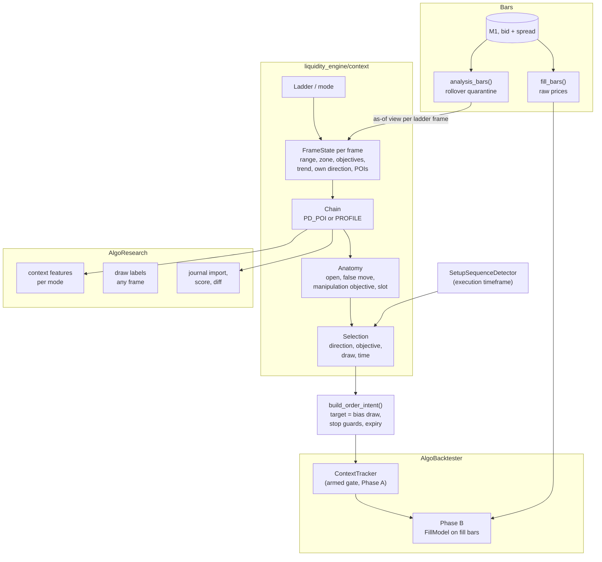

# Design Document

**Spec**: Context Engine
**Requirements**: `.kiro/specs/context-engine/requirements.md`

## Overview

The Context Engine gives the speculator what the 2026-10-10 replays showed it lacks: knowing which pool or array matters now, from the frames above, at any scale. It rests on five design choices:

1. **One frame-relative core.** Dealing range, zone, objectives, trend, POIs and the candle's anatomy are computed by the same functions for every frame. They read candles and calendar positions, never a timeframe constant, so a ladder is configuration (Requirement 1) and the logic is the same at every scale (Property 1).
2. **Context is a chain, not a vote.** Each child reads its parent's state and takes one of three cases (with the parent, against it toward its POI, or NEUTRAL), with a reason. A context is never a weighted sum, so every trade can be explained in the user's own terms (Requirement 4).
3. **Selection lives above the setup.** The setup sequence (raid → CISD → PD array) stays the trigger. The chain decides which setups count: direction, the objective raided, the draw ahead and the time. Each rule can be switched off, so the backtester measures each one (Requirement 6).
4. **Today's engine is a mode.** `legacy` reproduces it exactly, so every result has its baseline (Property 5). The D1 candle profile is the chain rule `PROFILE` on W1 → D1 (Property 6).
5. **Measured before traded, calibrated against the user.** AlgoResearch tests the chain's direction calls per mode before a backtest (Requirement 9). The user's journal is replayed through the chain, and each disagreement names a rule (Requirement 10).

### Changes to existing code

| # | Change | Why |
|---|---|---|
| C1 | `agent/strategy_config.py`: `mode`, `ladder` (custom), `rollover_quarantine`, `chain_rule`, the four selection switches, `setups_per_candle`, `time_limit`; `min_stop_spreads` defaults to 2 in the context modes | Requirements 1, 2, 6, 7. The defaults keep `legacy` unchanged. |
| C2 | `services/market_data/analysis_bars.py` (new), called by `algo_backtester/data.py` and the live runner when building the engine's bars | Requirement 2. Fill bars keep the raw prices. |
| C3 | `liquidity_engine/engine.py`: `analyze()` dispatches on the mode. `legacy` takes today's path, untouched. The context modes run `ContextEngine` | Requirements 1, 11 |
| C4 | `liquidity_engine/models.py`: `LiquidityMap.context` (optional `ChainState`); `NoTrade` reasons `CONTEXT_*`, `STOP_TOO_CLOSE`, `ZERO_RISK` | Requirements 4, 6, 7 |
| C5 | `agent/order_intent.py`: context targets, the zero-risk guard (every mode), expiry at the bias candle's close | Requirement 7 |
| C6 | `algo_backtester/signals.py`: the armed gate and the incremental `ContextTracker`; `cache.py`: the mode and ladder in the key | Requirement 8 |
| C7 | `algo_backtester/simulation.py` and `report.py`: the `BIAS_CANDLE` time exit; breakdowns by mode, case and rule | Requirements 7.4, 8.3 |
| C8 | `algo_research/features/context.py`, `labels.py` (any-frame draw labels), `journal.py` (new) | Requirements 9, 10 |
| C9 | `scripts/run_live_agent.py`: `--mode`, and the quarantine on the live M1 feed | Requirements 1.3, 2.6 |
| C10 | `.gitignore`: `data/journal/` | Requirement 10.4 |

The zero-risk guard (C5) applies to `legacy` too. Legacy parity (Property 5) is checked on the fixtures and on the golden journal, neither of which holds a zero-risk order; the one 2026-10-10 order with a stop at the entry came from the no-limits replay.

---

## Architecture



### Package layout

```
liquidity_engine/context/
    __init__.py
    ladder.py        # Ladder, MODES, validation (nesting), from TOML
    frame_state.py   # dealing range, zone, objectives, trend, own direction, POIs
    chain.py         # PD_POI and PROFILE rules; ChainState
    anatomy.py       # the frame candle: open, elapsed, false move, manipulation objective, slot
    windows.py       # the measured volatility windows (read from the profile table)
    selection.py     # the four rules; NoTrade reasons
    engine.py        # ContextEngine.analyze(view, instrument, t, cfg) -> LiquidityMap
services/market_data/analysis_bars.py
algo_research/features/context.py
algo_research/journal.py
config/context/windows/<profile>-<version>.toml   # measured active slots
config/backtests/modes.toml
config/research/journal.toml
```

---

## Components and Interfaces

### Ladder and modes (`context/ladder.py`)

```python
@dataclass(frozen=True)
class Ladder:
    frames: tuple[Timeframe, ...]     # highest first, 1-4
    execution: Timeframe              # below frames[-1]

    @property
    def bias(self) -> Timeframe: ...  # frames[-1]

MODES = {
    "position": Ladder((MN1, W1), H4),
    "intraday": Ladder((W1, D1), M15),
    "mid":      Ladder((D1, H4, H1), M5),
    "scalp":    Ladder((H4, H1, M15), M1),
}
```

- **Validation** uses `StrategyCalendar`. For each pair, every child candle's start and end fall inside one parent candle, checked over a year of calendar instants, DST changes included. W1 under MN1 is the exception: a week belongs to its open's month.
- **Candle counts** per frame come from `StrategyConfig.candle_counts`. A ladder frame missing from it is a configuration error.

### Analysis bars (`services/market_data/analysis_bars.py`)

```python
def analysis_bars(m1: Sequence[StoredBar], k: float = 3.0, max_minutes: int = 60) -> list[StoredBar]
```

Steps:
1. The typical spread at each bar is the median of the previous 1,440 recorded spreads (a rolling window, no look-ahead).
2. From each 17:00 New York bar, bars are quarantined while `spread >= k × typical`, for at most `max_minutes`.
3. A quarantined bar becomes flat at the last clean close (open = high = low = close).

Bars outside the window come back unchanged; with the setting off, the input comes back as is. `fill_bars()` is never fed these bars.

The aggregation into H4, D1 and W1 runs on the quarantined M1, so each frame sees the same prices. The D1 open becomes the last clean close before 17:00, which is the session's true open.

### Frame state (`context/frame_state.py`)

```python
def frame_state(frame: Timeframe, candles: Sequence[Candle], parents: Mapping[Timeframe, Sequence[Candle]],
                forming_open: float, price: float, pd_arrays: Sequence[PDArray],
                asia: Optional[tuple[float, float]]) -> FrameState
```

1. **Dealing range.**
   - Swings come from `find_swing_highs`/`find_swing_lows` (lookback 2). A swing is known from the open of the bar after its confirming bar.
   - `range_high` is the last confirmed swing high, or the highest high since, if a later bar traded above it. `range_low` mirrors it.
   - With no confirmed swing on a side, the state is `UNRANGED` and its zone is null.
2. **Zone.** `position = (price − low) / (high − low)`. PREMIUM above 0.55, DISCOUNT below 0.45, else EQUILIBRIUM.
3. **Objectives.** The candle profile's `nearest_objectives()` generalised:
   - Pools: swings (lookback 2) on F and its parents, F's and the parent's previous candle high and low, and the Asian range for F ≤ D1.
   - Unfilled FVGs on F and its parents, at their near edge.
   - An objective is untaken while no later closed bar traded beyond it (a pool) or into it (an FVG).
4. **Trend and own direction.** LE-D15 at F: the last closed candle against the previous one's high or low. Trending: toward the nearest objective in the trend's direction. Otherwise: toward the nearer of the nearest above and below.
5. **POIs.**
   - For BULLISH, the nearest unfilled bullish FVG or order block on F or a parent, below price, with its high at or below equilibrium.
   - For BEARISH, the mirror: above price, with its low at or above equilibrium.
   - Each POI records its timeframe, its zone (high and low) and when it formed.
6. **Reasons.** Each step appends a reason string.

The function receives candles, not a timeframe-specific source. The frame argument is used only to label output, and to look up calendar positions (the Asian range, the slot table).

### The chain (`context/chain.py`)

```python
def chain(states: Sequence[FrameState], rule: ChainRule) -> ChainState   # highest first
```

`PD_POI`, for each child C under parent P with context direction D:

```
if D is NEUTRAL:                                  C.context = NEUTRAL,  case = PARENT_NEUTRAL
elif P.poi[D] exists and not P.poi[D].reached
     and P.zone is the wrong zone for D:          C.context = opposite(D), case = TO_PARENT_POI,
                                                  C.draw = P.poi[D] near edge
else:                                             C.context = D, case = WITH_PARENT,
                                                  C.draw = C's nearest objective in D's direction
```

"Wrong zone" means PREMIUM for a bullish D and DISCOUNT for a bearish one. "Reached" means a bar of any ladder frame, or of the execution timeframe, traded into the POI after it formed and after P's dealing range last changed. When C has no objective in its direction, its draw is null and the chain is not armed.

`PROFILE` reproduces the candle profile: the child takes the parent's trend toward the parent's nearest objective when the parent is trending, and its own nearer objective otherwise.

### Anatomy and windows (`context/anatomy.py`, `windows.py`)

For each frame candle containing t:
- **Open, and the elapsed fraction** from the calendar.
- **The false move.** The furthest excursion beyond the open against the frame's context direction, in units of the frame's normal range: the median range of the last 20 candles, known at the open.
- **The manipulation objective:** the nearest untaken objective beyond the open against the context direction, with `reached_at`.
- **The slot:** the sub-candle index (D1 by H4, H4 by H1, H1 by M15, W1 by weekday, MN1 by week), and whether the windows table marks it active for the instrument.

The windows table is written by AlgoResearch's `profile` command (task 273 extended to every frame) to `config/context/windows/<profile>-<version>.toml`. Runs record the version.

### Selection (`context/selection.py`)

```python
def select(sequence: SetupSequence, chain: ChainState, anatomy: CandleAnatomy, cfg: StrategyConfig,
           taken_this_candle: int) -> Optional[NoTradeReason]
```

The rules are checked in order, each only when its switch is on; the first that fails is returned:
1. `CONTEXT_DIRECTION`: the sequence's direction ≠ the bias frame's context direction.
2. `CONTEXT_OBJECTIVE`: the raid didn't take the manipulation objective, or a pool beyond the bias candle's open on the same side, inside the current bias candle.
3. `CONTEXT_DRAW`: the bias draw is taken, or is less than `min_rr` R from the entry.
4. `CONTEXT_TIME`: the raid's slot isn't active.
5. `CANDLE_LIMIT`: `taken_this_candle >= setups_per_candle`.

Each rule only removes, never adds (Property 8).

### Orders (`agent/order_intent.py`)

In context modes:
- **Targets.** TP1 is the bias draw. TP2 is the parent's draw when it lies beyond TP1; otherwise the SD level `tp_levels[1]`, as today.
- **Stop guards.** `STOP_TOO_CLOSE` applies under `min_stop_spreads`. `ZERO_RISK` applies whenever `|entry − stop|` is under one point (the instrument's `point`), in every mode.
- **Expiry and time exit.**
  - `expires_at` is the bias candle's close, carried on the intent. The SimBroker and paper broker read it before their own rule, so a context-mode order expires at its candle's close.
  - The `BIAS_CANDLE` time exit is applied by Phase B: at the candle's close, the open trade is closed at that bar's close, on the closing side.

### Engine integration (`context/engine.py`)

`ContextEngine.analyze(view, instrument, t, cfg)`:
1. Builds a frame state for each ladder frame, then the chain and the bias candle's anatomy.
2. When not armed: returns a `LiquidityMap` with `context` set and no setup grade (a `NoTrade` naming why: `CONTEXT_NEUTRAL`, `CONTEXT_DRAW_TAKEN` or `CONTEXT_NO_FALSE_MOVE`).
3. When armed: runs today's detectors on the execution timeframe and the frames (pools, PD arrays, `SetupSequenceDetector`), applies selection, then grades.

Today's `analyze()` stays the `legacy` path, byte for byte.

### Backtester: the armed gate (`algo_backtester/signals.py`)

`ContextTracker` keeps each frame's state per instrument while Phase A walks the execution closes:
- **A frame's state is recomputed only when one of its bars closes.** Between closes, the tracker updates only the reached and taken flags, and the false move, from the execution bars.
- **At an armed close,** `signal_at()` runs as today. At an unarmed close, no record is written; the manifest counts the unarmed closes per reason.
- **Property 7** compares a gated run with an ungated one on fixtures: identical orders.

### AlgoResearch (`features/context.py`, `labels.py`)

- **Features.** One row per bias-frame grid time (the execution close in the research grid: M15 for `intraday`, M5 for `mid`, M1 for `scalp`, H4 for `position`). The columns carry `ctx_<mode>_` prefixes, built by calling the same `frame_state` and `chain` functions on the snapshot's bars (no re-implementation; Property 2 covers them).
- **Labels.** Whether the bias candle reaches the context draw after t, and when (`ctx_draw_hit_after`, `ctx_draw_hit_at`), at any frame.
- **The hypotheses H011–H014** reuse the `anchor` event with `level = "ctx_draw"`, and the `complement` and `stratified` baselines.

### Journal (`algo_research/journal.py`)

- `import`: reads CSV or Markdown tables per `config/research/journal.toml` (a column map with unit and timezone hints) into `data/journal/<name>.parquet`. Unmapped columns go to `notes`.
- `score`: win rate and mean R with day-cluster intervals, by mode and instrument; unmatched records are listed.
- `diff`: for each record, the chain as of the record's time (the as-of view on the snapshot), side by side with the user's fields; agreement rates per frame; a Markdown report under `docs/research/journal/` that quotes record ids, not notes, unless the user allows notes.
- `calibrate`: the only command that feeds rule changes. It refuses any record dated inside the confirmation slice or the hold-out (Property 9).

---

## Data Models

```python
class Objective(BaseModel):          # existing, reused
    kind: Literal["POOL", "FVG"]; source: str; timeframe: Timeframe; price: float
    direction: BiasDirection; formed_at: datetime

class POI(BaseModel):
    direction: BiasDirection; timeframe: Timeframe; high: float; low: float
    formed_at: datetime; reached_at: Optional[datetime]

class FrameState(BaseModel):
    frame: Timeframe; candle_open: float; candle_open_time: datetime
    range_high: Optional[float]; range_low: Optional[float]; position: Optional[float]
    zone: Optional[Literal["PREMIUM", "DISCOUNT", "EQUILIBRIUM"]]
    objectives_above: list[Objective]; objectives_below: list[Objective]
    trend: Literal["UP", "DOWN", "NONE"]; own_direction: BiasDirection
    pois: dict[BiasDirection, POI]; reasons: list[str]

class ChainLink(BaseModel):
    frame: Timeframe; own_direction: BiasDirection; context_direction: BiasDirection
    case: Literal["TOP", "WITH_PARENT", "TO_PARENT_POI", "PARENT_NEUTRAL"]
    draw: Optional[Objective]; draw_taken_at: Optional[datetime]; reasons: list[str]

class CandleAnatomy(BaseModel):
    frame: Timeframe; open: float; elapsed: float
    false_move: float; manipulation_objective: Optional[Objective]; manipulation_reached_at: Optional[datetime]
    slot: int; slot_active: Optional[bool]

class ChainState(BaseModel):
    mode: str; ladder: list[Timeframe]; execution: Timeframe; rule: Literal["PD_POI", "PROFILE"]
    states: list[FrameState]; links: list[ChainLink]; anatomy: CandleAnatomy
    armed: bool; unarmed_reason: Optional[str]

class JournalRecord(BaseModel):
    id: str; instrument: str; at: datetime; mode: Optional[str]
    bias: dict[Timeframe, BiasDirection]; draw: Optional[float]; poi: Optional[str]
    entry: Optional[float]; stop: Optional[float]; target: Optional[float]; result_r: Optional[float]
    skipped: bool; skip_reason: Optional[str]; notes: str
```

`TradeContext` (backtester) gains `chain`: the links and the anatomy, JSON-ready, for the report.

---

## Correctness Properties

Each property is a test; "Hypothesis" means a property-based test with the `hypothesis` library.

### Property 1: Frame Invariance

*For any* candle series (Hypothesis), `frame_state` on the series labelled as timeframe A SHALL equal `frame_state` on the same series labelled as timeframe B with its timestamps rescaled, in every field except the calendar-derived ones (the Asian range, the slot).
**Validates: Requirements 3.1, 3.2**

### Property 2: Only the Past

*For any* instrument and execution close t in a fixture (Hypothesis), the `ChainState` at t SHALL equal the one computed with every bar after t removed. The same holds for AlgoResearch's context features.
**Validates: Requirements 1.4, 4.6, 9.1**

### Property 3: Chain Consistency

*For any* chain (Hypothesis over random frame states), each child's context direction SHALL be:
- its parent's (`WITH_PARENT`), or
- the opposite, toward an unreached parent POI from the parent's wrong zone (`TO_PARENT_POI`), or
- NEUTRAL under a NEUTRAL parent.

Every non-null draw SHALL lie on the side of its frame's context direction.
**Validates: Requirements 4.2, 4.4, 4.6**

### Property 4: Quarantine Scope

*For any* M1 series (Hypothesis, with and without rollover blowouts):
- `analysis_bars()` SHALL change only the bars of a run that starts at 17:00 New York and continues while the spread stays at least k times typical, for at most 60 minutes;
- a series without blowouts SHALL come back unchanged;
- `fill_bars()` output SHALL be identical with the quarantine on or off.
**Validates: Requirements 2.1, 2.2, 2.4**

### Property 5: Legacy Parity

With `mode = legacy`, every `SignalRecord` on the backtester fixtures SHALL equal today's. Replaying the 2026-10-08 golden journal's period on the fixtures SHALL reproduce its rows.
**Validates: Requirements 1.3, 11.1**

### Property 6: Profile Parity

With `chain_rule = PROFILE` and ladder W1 → D1, the D1 link's draw and direction, and the trend, SHALL equal `CandleProfileAnalyzer`'s at every fixture t.
**Validates: Requirements 4.3**

### Property 7: Gating Is Invisible

On the fixtures, a gated Phase A run SHALL produce the same order intents, at the same times, as a run that evaluates every execution close.
**Validates: Requirements 8.2**

### Property 8: Rules Only Remove

*For any* fixture window and any subset of the selection switches, the setups taken with an extra switch on SHALL be a subset of those taken without it.
**Validates: Requirements 6.1, 6.5**

### Property 9: Calibration Can't See the Confirmation Data

`journal calibrate` SHALL refuse any record dated inside the confirmation slice or the hold-out, naming it, before any rule is read or written.
**Validates: Requirements 10.5**

---

## Error Handling

| Situation | Behaviour |
|---|---|
| Ladder breaks nesting, or execution isn't below the bias frame | Config error at load, naming the pair |
| A frame lacks warm-up at t | `NoTrade` `CONTEXT_UNAVAILABLE`, naming the frame and the bars short |
| A mode lacks history for the run (CE-D11) | The run is refused before Phase A, listing per frame what's missing |
| No windows table for the profile and `time` rule on | Config error: run `algo_research profile` first, or switch the rule off |
| Journal column unmapped | Kept in `notes`; listed in the import summary |
| Journal record outside the candle data | Listed in the score and diff reports as unmatched |
| Journal record in the confirmation slice or hold-out passed to `calibrate` | Refused (Property 9) |

---

## Testing Strategy

- **Unit tests**, with hand-made candle fixtures, for each component: the range stretching past a broken swing, the zone bands, POI eligibility, each chain case, the false move, slots across DST, and each selection rule.
- **Property tests** (Hypothesis) for Properties 1–4 and 8.
- **Parity tests** on the backtester fixtures for Properties 5–7. These are the safety net: a context change must never move `legacy`.
- **AlgoResearch:** the context features equal the engine's chain at sampled times (engine parity, like AlgoResearch Property 4), plus the any-frame labels' future-only property.
- **Journal:** import round trips on a synthetic export, and a diff report on three hand-written records whose expected agreement is known.
- **Speed:** Phase A per mode on the fixtures, gated against ungated, recorded in the checkpoint.

Tests live in `backend/tests/test_context_*.py`; fixtures under `backend/tests/fixtures/context/`.

---

## Traceability

| Requirement | Design | Properties | Tasks |
|---|---|---|---|
| 1 Frames and ladders | Ladder and modes | 2, 5 | 275 |
| 2 Analysis prices | Analysis bars | 4 | 276 |
| 3 Frame state | Frame state | 1 | 277 |
| 4 The chain | The chain | 2, 3, 6 | 278 |
| 5 Time | Anatomy and windows | — | 279 |
| 6 Selection | Selection | 8 | 284 |
| 7 Orders | Orders | — | 285 |
| 8 Backtester modes | The armed gate | 7 | 286 |
| 9 Research first | AlgoResearch | 2 | 281, 283 |
| 10 Journal | Journal | 9 | 282 |
| 11 Legacy parity, reasons | Engine integration | 5 | 280, 286 |
| 12 Evaluation | — | — | 288, 289 |
