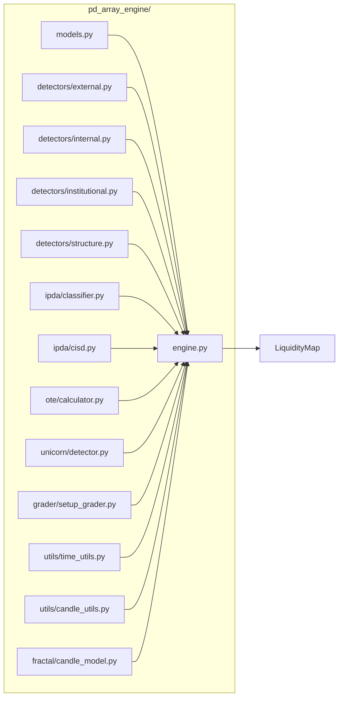
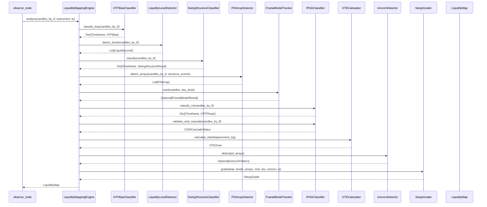
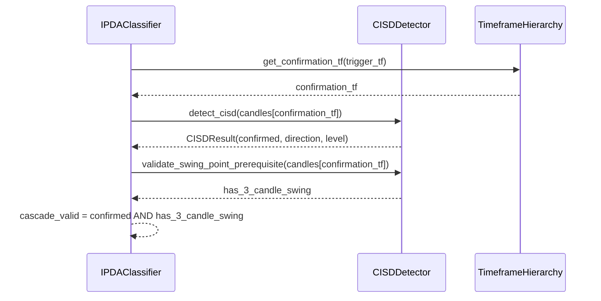

# Design Document: 

**spec**: PD Array Engine

## Overview

The PD Array Engine is a pure-Python analytical package that encodes the complete ICT/TTrades multi-timeframe trading methodology into a deterministic, stateless computation pipeline. It consumes multi-timeframe OHLCV candle data and produces a `LiquidityMap`  a structured object containing every analytical output the methodology requires: HTF bias per timeframe, tiered swing structure with BOS/CHoCH events, all identified liquidity levels (BSL/SSL), all PD arrays (FVG, OB, Breaker, IFVG, BPR, CISD), the Fractal Model candle-closure sequence and Equilibrium, CRT phase classification, CISD cascade status, draw-on-liquidity target, sweep detection, UNICORN pattern detection, OTE Fibonacci zone, and a final setup grade (A+/A/B/NO_TRADE).

The engine is designed to be called once per candle close from `agent/nodes/observe_node.py`. Its output is stored on `AgentState.liquidity_map` and injected into the LLM reasoning prompt via `LiquidityMap.to_agent_context()`. It replaces `backend/trader/agents/power_of_3.py`, `backend/trader/analysis/patterns.py`, and the stub `backend/trader/agents/pd_array/` directory. A `services/liquidity/` microservice will wrap it for HTTP/Kafka access post-v1.

This spec is **parked for post-v1 implementation** (after tasks 143 ship). It is written to be complete enough for any developer to implement without further clarification.

### Non-Goals (Deferred)

**SMT (Smart Money Divergence)** — cross-instrument correlation divergence used as continuation confluence in the TTrades "Breaker Continuations" material — is explicitly out of scope. It requires multi-instrument candle input, which is a signature change to `LiquidityMappingEngine.analyze()` (currently single-`instrument`). See `requirements.md` → Non-Goals for the full rationale. Do not add a partial/best-effort SMT hook to this engine; it belongs in a dedicated follow-on spec.

---

## Architecture

```mermaid
graph TD
    A[Multi-TF OHLCV Input] --> B[LiquidityMappingEngine]
    B --> C[HTFBiasClassifier]
    B --> D[LiquidityLevelDetector]
    B --> D2[SwingStructureClassifier]
    B --> E[PDArrayDetector]
    B --> E2[FractalModelTracker]
    B --> F[IPDAClassifier]
    B --> G[OTECalculator]
    B --> H[UnicornDetector]
    B --> I[SetupGrader]
    C --> J[LiquidityMap]
    D --> J
    D2 --> J
    E --> J
    E2 --> J
    F --> J
    G --> J
    H --> J
    I --> J
    J --> K[AgentState.liquidity_map]
    J --> L[to_agent_context()  LLM prompt]
```



### Package Layout

```
pd_array_engine/
 __init__.py                  # exports: LiquidityMappingEngine, LiquidityMap
 models.py                    # all Pydantic v2 data models
 engine.py                    # LiquidityMappingEngine (orchestrator)
 detectors/
    __init__.py
    external.py              # BSL/SSL, PWH/PWL/PDH/PDL, equal highs/lows
    internal.py              # FVG, IFVG, OB, Breaker, BPR, CISD level
    institutional.py        # session highs/lows, trendline liquidity
    structure.py              # STH/STL/ITH/ITL/LTH/LTL tiering + BOS/CHoCH
 ipda/
    __init__.py
    classifier.py            # CRT phase detection (C1/C2/C3/C4)
    cisd.py                  # CISD detection + cascade validation
 ote/
    __init__.py
    calculator.py            # Fibonacci OTE zone (0.620.79)
 unicorn/
    __init__.py
    detector.py              # Breaker + FVG overlap detection
 grader/
    __init__.py
    setup_grader.py          # A+/A/B/NO_TRADE scoring
 fractal/
    __init__.py
    candle_model.py           # Candle 1-4 Fractal Model closures + Equilibrium
 utils/
     __init__.py
     time_utils.py            # EST/UTC-4 conversions, killzone windows
     candle_utils.py          # swing point detection, candle helpers, candle type classification
```

---

## Sequence Diagrams

### Main Engine Call (per candle close)



### CISD Cascade Validation



---

## Components and Interfaces

### Candle Type Classification (utils/candle_utils.py)

**Purpose**: Classifies a single candle's wick-to-range ratio as `EXPANSION`, `REVERSAL`, or `REVERSAL_EXPANSION`. A stateless utility function, not a pipeline stage of `LiquidityMappingEngine.analyze()` — detectors call it directly when it strengthens a `strength_score` (e.g. an OB formed on a `REVERSAL`-type candle is a stronger footprint than one formed on an ambiguous doji).

**Interface**:
```python
EXPANSION_WICK_RATIO_MAX: float = 0.25
REVERSAL_WICK_RATIO_MIN: float = 0.5

def classify_candle_type(candle: Candle) -> CandleType: ...
```

**Responsibilities**:
- `wick_ratio = max(candle.upper_wick, candle.lower_wick) / candle.total_range` (candles with `total_range == 0` classify as `EXPANSION`)
- `wick_ratio <= EXPANSION_WICK_RATIO_MAX` → `EXPANSION` (strong directional close, small opposing wick)
- `wick_ratio >= REVERSAL_WICK_RATIO_MIN` → `REVERSAL` (large rejection wick)
- otherwise → `REVERSAL_EXPANSION` (directional body with a moderate rejection wick)
- Thresholds are named constants, not inline literals, so they can be recalibrated against a backtest without touching call sites

### LiquidityMappingEngine

**Purpose**: Top-level orchestrator. Accepts raw multi-timeframe candle data, runs all sub-detectors in dependency order, assembles and returns a `LiquidityMap`.

**Interface**:
```python
class LiquidityMappingEngine:
    def analyze(
        self,
        candles_by_tf: Dict[Timeframe, List[Candle]],
        instrument: str,
        timestamp: datetime,
    ) -> LiquidityMap: ...

    def _classify_htf_bias(
        self, candles_by_tf: Dict[Timeframe, List[Candle]]
    ) -> Dict[Timeframe, HTFBias]: ...

    def _detect_liquidity_levels(
        self, candles_by_tf: Dict[Timeframe, List[Candle]]
    ) -> List[LiquidityLevel]: ...

    def _classify_swing_structure(
        self, candles_by_tf: Dict[Timeframe, List[Candle]]
    ) -> Dict[Timeframe, SwingStructureResult]: ...

    def _detect_pd_arrays(
        self,
        candles_by_tf: Dict[Timeframe, List[Candle]],
        swing_structure: Dict[Timeframe, SwingStructureResult],
    ) -> List[PDArray]: ...

    def _track_fractal_model(
        self,
        candles: List[Candle],
        key_level: Optional[float],
    ) -> Optional[FractalModelResult]: ...

    def _classify_crt_phases(
        self, candles_by_tf: Dict[Timeframe, List[Candle]]
    ) -> Dict[Timeframe, CRTPhase]: ...

    def _validate_cisd_cascade(
        self, candles_by_tf: Dict[Timeframe, List[Candle]]
    ) -> CISDCascadeStatus: ...

    def _find_draw_on_liquidity(
        self,
        bias: Dict[Timeframe, HTFBias],
        levels: List[LiquidityLevel],
    ) -> Optional[LiquidityLevel]: ...

    def _detect_sweep(
        self,
        candles_by_tf: Dict[Timeframe, List[Candle]],
        draw: Optional[LiquidityLevel],
    ) -> bool: ...
```

**Responsibilities**:
- Validate that required timeframes are present in input
- Call sub-components in correct dependency order
- Assemble the final `LiquidityMap`
- Never mutate input candle data

### HTFBiasClassifier

**Purpose**: Determines BULLISH/BEARISH/NEUTRAL bias for each timeframe by comparing current price to that timeframe's candle open. Implements Layer 1 of the methodology.

**Interface**:
```python
class HTFBiasClassifier:
    def classify(
        self,
        candles_by_tf: Dict[Timeframe, List[Candle]],
        current_price: float,
    ) -> Dict[Timeframe, HTFBias]: ...

    def _get_reference_open(
        self, tf: Timeframe, candles: List[Candle], timestamp: datetime
    ) -> float: ...
```

**Responsibilities**:
- For DAILY: use NY midnight (00:00 EST) open as primary reference; 18:00 EST open as secondary
- For WEEKLY: use Sunday 18:00 EST open
- For MONTHLY: use first candle open of the calendar month
- BULLISH = current price above open (hunt longs below open)
- BEARISH = current price below open (hunt shorts above open)
- NEUTRAL = price within 0.01% of open (instrument-relative tolerance)

### LiquidityLevelDetector (detectors/external.py + institutional.py)

**Purpose**: Identifies all external liquidity pools where stop orders rest. Implements Layer 5.

**Interface**:
```python
class LiquidityLevelDetector:
    def detect(
        self,
        candles_by_tf: Dict[Timeframe, List[Candle]],
        timestamp: datetime,
    ) -> List[LiquidityLevel]: ...

    def _detect_previous_highs_lows(
        self, candles_by_tf: Dict[Timeframe, List[Candle]]
    ) -> List[LiquidityLevel]: ...

    def _detect_equal_highs_lows(
        self, candles: List[Candle], tolerance_pct: float = 0.001
    ) -> List[LiquidityLevel]: ...

    def _detect_session_highs_lows(
        self, candles: List[Candle], timestamp: datetime
    ) -> List[LiquidityLevel]: ...

    def _score_level(
        self, level: LiquidityLevel, candles: List[Candle]
    ) -> float: ...
```

**Responsibilities**:
- Detect PWH/PWL (previous week high/low) from weekly candles
- Detect PDH/PDL (previous day high/low) from daily candles
- Detect PMH/PML (previous month high/low) from monthly candles
- Detect equal highs/lows: two or more swing points within `tolerance_pct` of each other
- Detect session highs/lows (London, NY AM, NY PM) from intraday candles
- Score each level by: number of touches, timeframe significance, recency

### SwingStructureClassifier (detectors/structure.py)

**Purpose**: Classifies swing points into a nested Short-Term / Intermediate-Term / Long-Term hierarchy and emits BOS/CHoCH structure events. Implements the "Basic/Advanced Market Structure" layer that the flat swing detection in `utils/candle_utils.py` doesn't cover on its own.

**Interface**:
```python
class SwingStructureClassifier:
    def classify(
        self,
        candles_by_tf: Dict[Timeframe, List[Candle]],
    ) -> Dict[Timeframe, "SwingStructureResult"]: ...

    def _promote_tier(
        self, swings: List["SwingPoint"], candles: List[Candle]
    ) -> List["SwingPoint"]: ...

    def _classify_structure_events(
        self, swings: List["SwingPoint"], candles: List[Candle]
    ) -> List["StructureEvent"]: ...
```

**Responsibilities**:
- Seed `SwingTier.SHORT_TERM` points directly from `candle_utils.find_swing_highs`/`find_swing_lows`
- Promote a `SHORT_TERM` swing to `INTERMEDIATE_TERM` when the opposite-side short-term swing adjacent to it is broken; promote `INTERMEDIATE_TERM` → `LONG_TERM` the same way one tier up
- Every promoted `SwingPoint` keeps `derived_from_swing_id` pointing at the lower-tier point it came from
- Emit a `BOS` `StructureEvent` when price closes beyond the most recent same-tier swing in the direction of the prevailing trend at that tier; emit `CHOCH` when it closes beyond it against the prevailing trend
- Pure and stateless — same candles in, same `SwingStructureResult` out
- Output feeds `PDArrayDetector` (Breaker `structure_confirmed`, see below) and `LiquidityMap.swing_structure`

### PDArrayDetector (detectors/internal.py)

**Purpose**: Detects all Price Delivery Arrays. Implements Layer 6.

**Interface**:
```python
class PDArrayDetector:
    def detect(
        self,
        candles_by_tf: Dict[Timeframe, List[Candle]],
        swing_structure: Dict[Timeframe, "SwingStructureResult"],
    ) -> List[PDArray]: ...

    def _detect_fvg(
        self, candles: List[Candle], tf: Timeframe
    ) -> List[PDArray]: ...

    def _detect_order_blocks(
        self, candles: List[Candle], tf: Timeframe
    ) -> List[PDArray]: ...

    def _detect_breaker_blocks(
        self,
        candles: List[Candle],
        ob_list: List[PDArray],
        structure_events: List["StructureEvent"],
    ) -> List[PDArray]: ...

    def _detect_ifvg(
        self, candles: List[Candle], fvg_list: List[PDArray]
    ) -> List[PDArray]: ...

    def _detect_bpr(
        self, fvg_list: List[PDArray]
    ) -> List[PDArray]: ...

    def _detect_cisd_levels(
        self, candles: List[Candle], tf: Timeframe
    ) -> List[PDArray]: ...
```

**Responsibilities**:
- FVG: 3-candle imbalance  gap between `candles[i-2].low` and `candles[i].high` (bullish) or `candles[i-2].high` and `candles[i].low` (bearish)
- OB: last up-close candle before bearish expansion (bearish OB); last down-close candle before bullish expansion (bullish OB)
- Breaker: violated OB that has flipped polarity  track OBs that price has traded through and tag as breaker. Additionally sets `structure_confirmed = True` on the `BREAKER` when `structure_events` contains a same-tier BOS/CHoCH on the opposing side of the OB formed after the violation (a sweep-then-structural-break sequence — see `Breaker-Blocks-TTrades-PDF.pdf` pp. 3–13); this is additive and does not change *when* a BREAKER is first tagged, only an added confirmation flag
- IFVG: previously filled FVG (price has traded through it)  now acts as opposing array
- BPR: overlapping bullish FVG and bearish FVG at the same price level
- CISD level: the open price of the first candle in the delivery sequence that was violated

### FractalModelTracker (fractal/candle_model.py)

**Purpose**: Tracks the Candle 1–4 "Fractal Model" continuation/reversal closure sequence relative to an HTF Key Level, and computes the Equilibrium of the developing range. This is the single-candle-resolution layer that sits below CISD and OTE — see `Candle-2-TTrades-PDF.pdf` / `Candle-2-Closure-TTrades-PDF.pdf` / `Candle-3-Closure-TTrades.pdf`.

**Interface**:
```python
class FractalModelTracker:
    def track(
        self,
        candles: List[Candle],
        key_level: Optional[float],
    ) -> Optional["FractalModelResult"]: ...

    def _classify_closure(
        self, prior: Candle, current: Candle
    ) -> "ClosureType": ...
```

**Responsibilities**:
- Step 1 = the reference candle, `closure_type = None` (nothing to compare against yet)
- Step N (N ≥ 2): `CONTINUATION` when the candle's close extends the developing range in the same direction; `REVERSAL` when it closes back within the prior step's range on the opposite side of the prior step's open (this is CISD-equivalent logic at candle-pair granularity)
- `range_high`/`range_low` only ever expand as steps accumulate; `equilibrium = (range_high + range_low) / 2` always
- Returns `None` when there isn't enough candle data to seed a sequence, rather than a degenerate/zero-range result
- `key_level` is supplied by the caller (`LiquidityMappingEngine`), typically a `LiquidityLevel.price` or `HTFBias.reference_open` — this component does not select its own key level

### IPDAClassifier (ipda/classifier.py + ipda/cisd.py)

**Purpose**: Classifies CRT phase (C1/C2/C3/C4) per timeframe and validates the CISD cascade. Implements Layer 3.

**Interface**:
```python
class IPDAClassifier:
    CISD_CASCADE: Dict[Timeframe, Timeframe] = {
        Timeframe.MONTHLY: Timeframe.DAILY,
        Timeframe.WEEKLY: Timeframe.H4,
        Timeframe.DAILY: Timeframe.H1,
        Timeframe.H4: Timeframe.M15,
        Timeframe.M30: Timeframe.M3,
        Timeframe.M15: Timeframe.M1,
    }

    def classify_crt_phase(
        self, candles: List[Candle], tf: Timeframe
    ) -> CRTPhase: ...

    def validate_cisd_cascade(
        self,
        candles_by_tf: Dict[Timeframe, List[Candle]],
        trigger_tf: Timeframe,
    ) -> CISDCascadeStatus: ...

class CISDDetector:
    def detect(
        self, candles: List[Candle]
    ) -> Optional[CISDResult]: ...

    def _has_swing_point_prerequisite(
        self, candles: List[Candle]
    ) -> bool: ...
```

**Responsibilities**:
- C1 (Accumulation): range-building candles, ATR-relative tight range
- C2 (Manipulation): candle that closes within C1's range AND lower-TF CISD is confirmed
- C3 (Distribution/Expansion): strong directional candle away from C2
- C4 (Continuation): follow-through in C3 direction
- Bearish CISD: series of up-close candles  close BELOW open of first candle in sequence
- Bullish CISD: series of down-close candles  close ABOVE open of first candle in sequence
- Swing point prerequisite: price cannot reverse without a 3-candle swing point first

### OTECalculator (ote/calculator.py)

**Purpose**: Calculates the Optimal Trade Entry Fibonacci zone from the last displacement leg. Implements Layer 7 (OTE model).

**Interface**:
```python
class OTECalculator:
    FIBONACCI_LEVELS: List[float] = [0.0, 0.5, 0.62, 0.705, 0.79, 1.0]
    OTE_LOW: float = 0.62
    OTE_HIGH: float = 0.79
    GOLDEN_LEVEL: float = 0.705

    def calculate(
        self,
        swing_high: float,
        swing_low: float,
        direction: BiasDirection,
    ) -> OTEZone: ...

    def find_displacement_leg(
        self,
        candles: List[Candle],
        direction: BiasDirection,
    ) -> Optional[tuple[float, float]]: ...

    def price_in_ote(
        self, price: float, ote_zone: OTEZone
    ) -> bool: ...
```

**Responsibilities**:
- Anchor from swing HIGH to swing LOW for bullish setups (retracement into discount)
- Anchor from swing LOW to swing HIGH for bearish setups (retracement into premium)
- OTE zone = 0.62 to 0.79 retracement of the displacement leg
- Golden level = 0.705 (highest probability single entry price)
- Displacement leg = the most recent impulsive move that created a FVG

### UnicornDetector (unicorn/detector.py)

**Purpose**: Detects the UNICORN pattern  a Breaker Block and FVG overlapping at the same price level. Implements Layer 7 (UNICORN model).

**Interface**:
```python
class UnicornDetector:
    def detect(
        self,
        pd_arrays: List[PDArray],
        overlap_tolerance_pct: float = 0.001,
    ) -> Optional[UnicornPattern]: ...

    def _arrays_overlap(
        self,
        a: PDArray,
        b: PDArray,
        tolerance_pct: float,
    ) -> bool: ...
```

**Responsibilities**:
- Bullish UNICORN: Bullish Breaker Block + Bullish FVG with overlapping price ranges
- Bearish UNICORN: Bearish Breaker Block + Bearish FVG with overlapping price ranges
- Overlap = the intersection of the two arrays' price ranges
- Return the most recently formed UNICORN if multiple exist

### SetupGrader (grader/setup_grader.py)

**Purpose**: Evaluates all 8 A+ conditions and assigns a setup grade. Implements Layer 8.

**Interface**:
```python
class SetupGrader:
    def grade(
        self,
        liquidity_map: "LiquidityMap",
        timestamp: datetime,
    ) -> SetupGrade: ...

    def _check_htf_bias(self, lm: "LiquidityMap") -> bool: ...
    def _check_draw_on_liquidity(self, lm: "LiquidityMap") -> bool: ...
    def _check_liquidity_sweep(self, lm: "LiquidityMap") -> bool: ...
    def _check_displacement(self, lm: "LiquidityMap") -> bool: ...
    def _check_cisd(self, lm: "LiquidityMap") -> bool: ...
    def _check_entry_pd_array(self, lm: "LiquidityMap") -> bool: ...
    def _check_stop_placement(self, lm: "LiquidityMap") -> bool: ...
    def _check_time_window(self, lm: "LiquidityMap", ts: datetime) -> bool: ...
```

**Responsibilities**:
- A+ requires ALL 8 conditions true
- Grade A: 7/8 conditions  missing killzone alignment OR UNICORN (has OTE or single PD array)
- Grade B: sweep + CISD confirmed but entry PD array is weaker (FVG only, no breaker)
- NO_TRADE: fewer than 6 conditions met, or HTF bias missing, or no draw on liquidity
- When the `entry_array.structure_confirmed = True`, note it in `grade_reason` as corroborating strength — this does **not** add a 9th boolean condition and does **not** change `conditions_met`; likewise `LiquidityMap.fractal_model.price_above_equilibrium` may be referenced in `grade_reason`/`to_agent_context()` narrative but never gates the grade itself

---

## Data Models

All models use Pydantic v2. All price values are `float`. All timestamps are `datetime` (timezone-aware, UTC stored, EST displayed).

### Enums

```python
from enum import Enum

class Timeframe(str, Enum):
    M1  = "M1"
    M3  = "M3"
    M5  = "M5"
    M15 = "M15"
    M30 = "M30"
    H1  = "H1"
    H4  = "H4"
    D1  = "D1"
    W1  = "W1"
    MN1 = "MN1"

class BiasDirection(str, Enum):
    BULLISH = "BULLISH"
    BEARISH = "BEARISH"
    NEUTRAL = "NEUTRAL"

class PDArrayType(str, Enum):
    FVG          = "FVG"           # Fair Value Gap
    IFVG         = "IFVG"          # Inverse FVG (filled FVG, now opposing)
    OB           = "OB"            # Order Block
    BREAKER      = "BREAKER"       # Breaker Block (violated OB, flipped polarity)
    BPR          = "BPR"           # Balanced Price Range (overlapping FVGs)
    CISD_LEVEL   = "CISD_LEVEL"    # Open of first candle in violated delivery sequence

class LiquidityType(str, Enum):
    BSL = "BSL"   # Buy-Side Liquidity (resting above highs  stops from shorts)
    SSL = "SSL"   # Sell-Side Liquidity (resting below lows  stops from longs)

class LiquiditySource(str, Enum):
    PWH    = "PWH"    # Previous Week High
    PWL    = "PWL"    # Previous Week Low
    PDH    = "PDH"    # Previous Day High
    PDL    = "PDL"    # Previous Day Low
    PMH    = "PMH"    # Previous Month High
    PML    = "PML"    # Previous Month Low
    EQH    = "EQH"    # Equal Highs
    EQL    = "EQL"    # Equal Lows
    SESSION_HIGH = "SESSION_HIGH"
    SESSION_LOW  = "SESSION_LOW"
    TRENDLINE    = "TRENDLINE"

class CRTPhase(str, Enum):
    C1_ACCUMULATION  = "C1_ACCUMULATION"
    C2_MANIPULATION  = "C2_MANIPULATION"
    C3_DISTRIBUTION  = "C3_DISTRIBUTION"
    C4_CONTINUATION  = "C4_CONTINUATION"
    UNKNOWN          = "UNKNOWN"

class PricePhase(str, Enum):
    EXPANSION     = "EXPANSION"
    RETRACEMENT   = "RETRACEMENT"
    CONSOLIDATION = "CONSOLIDATION"
    MANIPULATION  = "MANIPULATION"

class SetupGrade(str, Enum):
    A_PLUS   = "A+"
    A        = "A"
    B        = "B"
    NO_TRADE = "NO_TRADE"

class KillzoneWindow(str, Enum):
    LONDON    = "LONDON"      # 02:0005:00 EST
    NY_AM     = "NY_AM"       # 07:0010:00 EST
    NY_PM     = "NY_PM"       # 13:3016:00 EST
    NONE      = "NONE"

class SwingTier(str, Enum):
    SHORT_TERM        = "SHORT_TERM"          # STH / STL
    INTERMEDIATE_TERM = "INTERMEDIATE_TERM"   # ITH / ITL
    LONG_TERM         = "LONG_TERM"            # LTH / LTL

class StructureEventType(str, Enum):
    BOS   = "BOS"     # Break of Structure  continuation
    CHOCH = "CHOCH"   # Change of Character  first sign of reversal

class CandleType(str, Enum):
    EXPANSION          = "EXPANSION"
    REVERSAL           = "REVERSAL"
    REVERSAL_EXPANSION = "REVERSAL_EXPANSION"

class ClosureType(str, Enum):
    CONTINUATION = "CONTINUATION"
    REVERSAL     = "REVERSAL"
```

### Core Candle Model

```python
from pydantic import BaseModel, field_validator
from datetime import datetime
from typing import Optional

class Candle(BaseModel):
    """Single OHLCV candle. Immutable after construction."""
    timestamp: datetime          # UTC, candle open time
    open: float
    high: float
    low: float
    close: float
    volume: Optional[int] = None
    timeframe: Timeframe
    instrument: str

    @field_validator("high")
    @classmethod
    def high_gte_low(cls, v: float, info) -> float:
        if "low" in info.data and v < info.data["low"]:
            raise ValueError(f"high ({v}) must be >= low ({info.data['low']})")
        return v

    @field_validator("high")
    @classmethod
    def high_gte_open_close(cls, v: float, info) -> float:
        for field in ("open", "close"):
            if field in info.data and v < info.data[field]:
                raise ValueError(f"high ({v}) must be >= {field} ({info.data[field]})")
        return v

    @property
    def is_bullish(self) -> bool:
        return self.close > self.open

    @property
    def is_bearish(self) -> bool:
        return self.close < self.open

    @property
    def body_size(self) -> float:
        return abs(self.close - self.open)

    @property
    def total_range(self) -> float:
        return self.high - self.low

    @property
    def upper_wick(self) -> float:
        return self.high - max(self.open, self.close)

    @property
    def lower_wick(self) -> float:
        return min(self.open, self.close) - self.low
```

### HTFBias Model

```python
class HTFBias(BaseModel):
    """HTF directional bias for a single timeframe."""
    timeframe: Timeframe
    direction: BiasDirection
    reference_open: float        # The candle open used as the bias anchor
    reference_open_time: datetime
    current_price: float
    distance_from_open: float    # current_price - reference_open (signed)
    distance_pct: float          # distance as % of reference_open
    is_deep_premium: bool        # price far above open in bearish context
    is_deep_discount: bool       # price far below open in bullish context
    # Deep = price beyond midnight/08:30 reference in the opposing direction
    midnight_reference: Optional[float] = None   # 00:00 EST price
    news_reference: Optional[float] = None       # 08:30 EST price
```

### LiquidityLevel Model

```python
class LiquidityLevel(BaseModel):
    """An identified external liquidity pool."""
    level_id: str                # UUID
    liquidity_type: LiquidityType   # BSL or SSL
    source: LiquiditySource
    price: float                 # exact price of the level
    timeframe: Timeframe         # timeframe on which it was identified
    formed_at: datetime          # when the level was created
    strength_score: float        # 0.01.0; higher = more significant
    touch_count: int             # number of times price has tested this level
    swept: bool = False          # True once price has traded through it
    swept_at: Optional[datetime] = None
    # For equal highs/lows: the tolerance band
    band_high: Optional[float] = None
    band_low: Optional[float] = None
```

### PDArray Model

```python
class PDArray(BaseModel):
    """A Price Delivery Array (imbalance or institutional footprint)."""
    array_id: str                # UUID
    array_type: PDArrayType
    direction: BiasDirection     # BULLISH = acts as support; BEARISH = acts as resistance
    timeframe: Timeframe
    high: float                  # upper boundary of the array
    low: float                   # lower boundary of the array
    formed_at: datetime          # timestamp of the candle that created it
    is_filled: bool = False      # True once price has fully traded through it
    filled_at: Optional[datetime] = None
    strength_score: float        # 0.01.0
    # For OB: the specific candle that is the order block
    ob_candle_open: Optional[float] = None
    ob_candle_close: Optional[float] = None
    # For Breaker: reference to the original OB it was derived from
    source_ob_id: Optional[str] = None
    # For Breaker: True once a same-tier BOS/CHoCH confirms the sweep-then-structural-break
    # sequence on the opposing side of the source OB (Requirement 4.15). Additive  never
    # gates BREAKER classification itself, only adds a confirmation signal.
    structure_confirmed: bool = False
    # For BPR: references to the two FVGs that form it
    bpr_bullish_fvg_id: Optional[str] = None
    bpr_bearish_fvg_id: Optional[str] = None
    # For CISD level: the open of the first candle in the violated sequence
    cisd_sequence_open: Optional[float] = None
```

### Swing Structure Models

```python
class SwingPoint(BaseModel):
    """A single swing high or swing low at a given tier."""
    swing_id: str                  # UUID
    tier: SwingTier
    is_high: bool                  # True = swing high, False = swing low
    price: float
    formed_at: datetime
    broken: bool = False
    broken_at: Optional[datetime] = None
    # Present when tier != SHORT_TERM  points at the lower-tier SwingPoint this was promoted from
    derived_from_swing_id: Optional[str] = None

class StructureEvent(BaseModel):
    """A BOS or CHoCH confirmation at a specific tier and timeframe."""
    event_id: str                  # UUID
    event_type: StructureEventType
    tier: SwingTier
    timeframe: Timeframe
    direction: BiasDirection       # direction of the break
    broken_swing_id: str           # the SwingPoint that was broken
    price: float                   # the closing price that confirmed the break
    confirmed_at: datetime

class SwingStructureResult(BaseModel):
    """Complete tiered swing structure for one timeframe."""
    timeframe: Timeframe
    short_term_highs: List[SwingPoint] = []
    short_term_lows: List[SwingPoint] = []
    intermediate_term_highs: List[SwingPoint] = []
    intermediate_term_lows: List[SwingPoint] = []
    long_term_highs: List[SwingPoint] = []
    long_term_lows: List[SwingPoint] = []
    events: List[StructureEvent] = []
    latest_event: Optional[StructureEvent] = None
```

### Fractal Model Result

```python
class FractalCandleStep(BaseModel):
    """One candle's position in the Fractal Model closure sequence."""
    step_index: int                 # 1-based; Step 1 is the reference candle
    candle_time: datetime
    close: float
    high: float
    low: float
    closure_type: Optional[ClosureType] = None   # None only for step_index == 1

class FractalModelResult(BaseModel):
    """Candle 1-4 Fractal Model tracking relative to an HTF Key Level."""
    key_level: float
    steps: List[FractalCandleStep] = []
    range_high: float
    range_low: float
    equilibrium: float               # (range_high + range_low) / 2, always
    price_above_equilibrium: bool
```

### CRT Phase Result

```python
class CRTPhaseResult(BaseModel):
    """CRT phase classification for a single timeframe."""
    timeframe: Timeframe
    phase: CRTPhase
    c1_range_high: Optional[float] = None   # C1 accumulation range top
    c1_range_low: Optional[float] = None    # C1 accumulation range bottom
    c2_close: Optional[float] = None        # C2 manipulation candle close
    c2_within_c1: bool = False              # C2 closed within C1 range
    c2_candle_time: Optional[datetime] = None
    confirmation_tf_cisd: bool = False      # lower-TF CISD confirmed C2
    confidence: float = 0.0                 # 0.01.0
```

### CISD Result

```python
class CISDResult(BaseModel):
    """Result of a CISD detection on a specific timeframe."""
    timeframe: Timeframe
    confirmed: bool
    direction: Optional[BiasDirection] = None   # direction of the CISD
    level: Optional[float] = None               # the open of the first candle in sequence
    sequence_start_time: Optional[datetime] = None
    violation_candle_time: Optional[datetime] = None
    has_swing_prerequisite: bool = False        # 3-candle swing point present

class CISDCascadeStatus(BaseModel):
    """CISD cascade validation across the timeframe hierarchy."""
    trigger_timeframe: Timeframe
    confirmation_timeframe: Timeframe
    cascade_valid: bool
    trigger_cisd: Optional[CISDResult] = None
    confirmation_cisd: Optional[CISDResult] = None
    # Full cascade chain for multi-TF alignment
    cascade_chain: list[CISDResult] = []
```

### OTE Zone

```python
class OTEZone(BaseModel):
    """Optimal Trade Entry Fibonacci zone."""
    swing_high: float
    swing_low: float
    direction: BiasDirection     # which way the trade is
    fib_0: float                 # 0% = start of displacement
    fib_50: float                # 50% retracement
    fib_62: float                # 62% retracement (OTE zone start)
    fib_705: float               # 70.5%  golden level (highest probability)
    fib_79: float                # 79% retracement (OTE zone end)
    fib_100: float               # 100% = end of displacement
    ote_high: float              # upper boundary of OTE zone
    ote_low: float               # lower boundary of OTE zone
    golden_level: float          # = fib_705
    displacement_leg_start: datetime
    displacement_leg_end: datetime
    # Whether current price is inside the OTE zone
    price_in_ote: bool = False
    current_price: Optional[float] = None
```

### UNICORN Pattern

```python
class UnicornPattern(BaseModel):
    """UNICORN = Breaker Block + FVG overlapping at the same price level."""
    direction: BiasDirection
    breaker_block: PDArray
    fvg: PDArray
    overlap_high: float          # upper boundary of the overlap zone
    overlap_low: float           # lower boundary of the overlap zone
    timeframe: Timeframe
    formed_at: datetime
    # Strength = combined score of breaker + FVG
    strength_score: float
```

### Setup Grade Detail

```python
class SetupGradeDetail(BaseModel):
    """Detailed breakdown of the 8-condition A+ checklist."""
    grade: SetupGrade

    # The 8 conditions
    htf_bias_confirmed: bool          # Condition 1
    draw_on_liquidity_identified: bool # Condition 2
    liquidity_sweep_confirmed: bool    # Condition 3
    displacement_present: bool         # Condition 4
    cisd_confirmed: bool               # Condition 5
    entry_pd_array_present: bool       # Condition 6
    stop_placement_valid: bool         # Condition 7
    time_window_aligned: bool          # Condition 8

    # Supporting detail
    conditions_met: int                # 08
    killzone_window: KillzoneWindow
    entry_array: Optional[PDArray] = None
    entry_array_is_unicorn: bool = False
    entry_array_is_ote: bool = False
    suggested_stop: Optional[float] = None   # beyond the entry PD array
    suggested_entry: Optional[float] = None  # golden level or array midpoint
    grade_reason: str                        # human-readable explanation
```

### LiquidityMap (top-level output)

```python
from typing import Dict, List, Optional
from datetime import datetime

class LiquidityMap(BaseModel):
    """
    Complete liquidity and structure analysis for one instrument at one timestamp.
    This is the primary output of LiquidityMappingEngine.analyze().
    Stored on AgentState.liquidity_map.
    """
    # Identity
    instrument: str
    analyzed_at: datetime        # UTC timestamp of the triggering candle close
    trigger_timeframe: Timeframe # the timeframe that triggered this analysis

    # Layer 1  HTF Bias
    htf_bias: Dict[str, HTFBias]  # key = Timeframe.value string

    # Layer 5  Liquidity Levels
    liquidity_levels: List[LiquidityLevel]
    draw_on_liquidity: Optional[LiquidityLevel] = None  # primary target
    sweep_detected: bool = False                         # sweep of draw_on_liquidity

    # Swing Structure  tiered STH/STL/ITH/ITL/LTH/LTL + BOS/CHoCH
    swing_structure: Dict[str, SwingStructureResult] = {}   # key = Timeframe.value string

    # Layer 6  PD Arrays
    pd_arrays: List[PDArray]

    # Fractal Model  Candle 1-4 closures relative to an HTF Key Level + Equilibrium
    fractal_model: Optional[FractalModelResult] = None

    # Layer 3  CRT / IPDA
    crt_phases: Dict[str, CRTPhaseResult]   # key = Timeframe.value string
    cisd_cascade: Optional[CISDCascadeStatus] = None

    # Layer 4  Price Phase
    current_price_phase: Optional[PricePhase] = None

    # Layer 7  Entry Models
    ote_zone: Optional[OTEZone] = None
    unicorn: Optional[UnicornPattern] = None

    # Layer 8  Setup Grade
    setup_grade: SetupGradeDetail

    # Convenience accessors
    def get_bias(self, tf: Timeframe) -> Optional[HTFBias]:
        return self.htf_bias.get(tf.value)

    def get_arrays_by_type(self, array_type: PDArrayType) -> List[PDArray]:
        return [a for a in self.pd_arrays if a.array_type == array_type]

    def get_arrays_in_range(
        self, price_low: float, price_high: float
    ) -> List[PDArray]:
        return [
            a for a in self.pd_arrays
            if not a.is_filled and a.low <= price_high and a.high >= price_low
        ]

    def to_agent_context(self) -> str:
        """
        Serialize the LiquidityMap to a structured string for LLM prompt injection.
        See section: to_agent_context() Output Format.
        """
        ...
```

**Validation Rules**:
- `analyzed_at` must be timezone-aware
- `htf_bias` must contain at least D1 and W1 entries
- `setup_grade.conditions_met` must equal the count of True boolean conditions
- `draw_on_liquidity` must be a member of `liquidity_levels` if set
- `ote_zone.ote_low < ote_zone.ote_high` always
- `unicorn.overlap_low < unicorn.overlap_high` always

---

## Error Handling

- **Missing required timeframes**: `LiquidityMappingEngine.analyze()` raises `ValueError` immediately when D1 or W1 is absent from `candles_by_tf` (Requirement 1.4), before any sub-component runs — there is no partial/degraded analysis mode.
- **Invalid candle data**: `Candle` validates OHLC integrity (`high >= low`, `high >= open`, `high >= close`) at Pydantic construction time (Requirement 11.1–11.3). The engine never receives a structurally invalid `Candle` — invalid data fails fast at the boundary where it's constructed, not deep inside a detector.
- **"Nothing found" is not an error**: `FractalModelTracker.track()`, `UnicornDetector.detect()`, and `LiquidityMappingEngine._find_draw_on_liquidity()` all return `None`/`Optional` rather than raising when there's insufficient data or no qualifying pattern — an empty result is an expected, common outcome of pure pattern detection, not a failure.
- **No defensive exception handling inside the engine**: because the package has zero I/O (Requirement 14.1), there are no network/DB/timeout errors to catch. `LiquidityMappingEngine.analyze()` and every sub-component SHALL let unexpected exceptions (bugs, not bad input) propagate uncaught — swallowing them would hide defects in deterministic, easily-testable pure functions where there is no excuse for a silent failure.
- **Caller's responsibility**: `agent/nodes/observe_node.py` (Task 160) is the only place that decides what happens if `analyze()` raises — whether that means setting `AgentState.liquidity_map = None` and continuing the candle-close cycle, or halting it. That policy belongs to the agent loop, not the engine.

## Testing Strategy

- Strict RED → GREEN → REFACTOR per task, matching the task boundaries in `tasks.md` — no production code is written before a failing test exists for it.
- One test file per module in `backend/tests/`, all prefixed `test_liquidity_`, mirroring `pd_array_engine/`'s package layout.
- Every Correctness Property below has a corresponding Hypothesis property-based test (`property_*`), run with `@settings(max_examples=100)` minimum (Requirement 14.6).
- `test_pd_array_engine.py` covers two levels: a mocked test asserting the exact sub-component call order (`test_sub_components_called_in_order`), and an unmocked end-to-end run through `analyze()` to catch wiring bugs that per-component unit tests can't see.
- Coverage gate: ≥ 90% line coverage across `pd_array_engine/`, measured by `pytest-cov`, enforced at the Task 161 final checkpoint (Requirement 14.7).
- `test_observe_node_liquidity.py` is the only suite in this spec that touches code outside `pd_array_engine/`; its scope is deliberately narrow — verifying `AgentState.liquidity_map` gets populated correctly, not re-testing engine internals already covered above.

## Correctness Properties

*A property is a characteristic or behaviour that should hold true across all valid executions of a system — essentially, a formal statement about what the system should do. Properties serve as the bridge between human-readable specifications and machine-verifiable correctness guarantees.*

### Property 1: Engine Determinism (Statelessness)

*For any* valid `candles_by_tf` dictionary and instrument/timestamp combination, calling `LiquidityMappingEngine.analyze()` twice with identical inputs SHALL produce two `LiquidityMap` objects that are equal in all fields.

**Validates: Requirements 1.2, 14.1**

---

### Property 2: Input Immutability

*For any* valid `candles_by_tf` input, after calling `LiquidityMappingEngine.analyze()`, every `Candle` object in the input dictionary SHALL have the same field values as before the call.

**Validates: Requirements 1.3**

---

### Property 3: HTF Bias Direction Correctness

*For any* timeframe and any `(current_price, reference_open)` pair where `current_price != reference_open` and the difference exceeds the 0.01% tolerance, `HTFBiasClassifier.classify()` SHALL return `BULLISH` when `current_price > reference_open` and `BEARISH` when `current_price < reference_open`.

**Validates: Requirements 2.1, 2.2**

---

### Property 4: HTF Bias Neutral Band

*For any* `current_price` within 0.01% of `reference_open`, `HTFBiasClassifier.classify()` SHALL return `NEUTRAL`.

**Validates: Requirements 2.3**

---

### Property 5: D1 and W1 Bias Always Present

*For any* valid multi-timeframe candle input that includes D1 and W1 candle series, `LiquidityMap.htf_bias` SHALL contain entries for both `"D1"` and `"W1"`.

**Validates: Requirements 2.6, 10.2**

---

### Property 6: All PDArray High Greater Than Low

*For any* candle sequence, every `PDArray` of any type (FVG, OB, BREAKER, IFVG, BPR, CISD_LEVEL) returned by `PDArrayDetector.detect()` SHALL satisfy `PDArray.high > PDArray.low`.

**Validates: Requirements 4.3, 4.6, 4.12**

---

### Property 7: OTE Zone Structural Ordering

*For any* displacement leg with a non-zero range, the `OTEZone` returned by `OTECalculator.calculate()` SHALL satisfy `fib_62 < fib_705 < fib_79`.

**Validates: Requirements 7.4**

---

### Property 8: OTE Zone Low Less Than High

*For any* displacement leg with a non-zero range, the `OTEZone` returned by `OTECalculator.calculate()` SHALL satisfy `ote_low < ote_high`.

**Validates: Requirements 7.5, 10.4**

---

### Property 9: OTE Golden Level Equals fib_705

*For any* computed `OTEZone`, `golden_level` SHALL equal `fib_705`.

**Validates: Requirements 7.6**

---

### Property 10: OTE Price-In-Zone Flag Correctness

*For any* `OTEZone` and any `current_price`, `price_in_ote` SHALL be `True` if and only if `ote_low <= current_price <= ote_high`.

**Validates: Requirements 7.9, 7.10**

---

### Property 11: UNICORN Overlap Well-Formed

*For any* detected `UnicornPattern`, `overlap_low < overlap_high` SHALL always hold.

**Validates: Requirements 8.3, 10.5**

---

### Property 12: UNICORN Returns Most Recent

*For any* list of qualifying Breaker+FVG pairs with distinct `formed_at` timestamps, `UnicornDetector.detect()` SHALL return the pair with the maximum `formed_at` value.

**Validates: Requirements 8.5**

---

### Property 13: Setup Grade conditions_met Accuracy

*For any* `SetupGradeDetail` object, `conditions_met` SHALL equal the sum of the 8 boolean condition fields: `htf_bias_confirmed + draw_on_liquidity_identified + liquidity_sweep_confirmed + displacement_present + cisd_confirmed + entry_pd_array_present + stop_placement_valid + time_window_aligned`.

**Validates: Requirements 9.2, 10.6**

---

### Property 14: A+ Grade Requires All 8 Conditions

*For any* `LiquidityMap`, the `SetupGrader` SHALL assign grade `A+` if and only if all 8 boolean conditions in `SetupGradeDetail` are `True` (`conditions_met == 8`). No `LiquidityMap` with `conditions_met < 8` SHALL receive grade `A+`.

**Validates: Requirements 9.1**

---

### Property 15: NO_TRADE Grade When Conditions Below Threshold

*For any* `LiquidityMap` where `conditions_met < 6`, OR where `htf_bias_confirmed = False`, OR where `draw_on_liquidity_identified = False`, THE `SetupGrader` SHALL assign grade `NO_TRADE`.

**Validates: Requirements 9.5**

---

### Property 16: draw_on_liquidity Reference Integrity

*For any* `LiquidityMap` where `draw_on_liquidity` is not `None`, `draw_on_liquidity.level_id` SHALL appear as the `level_id` of at least one member of `LiquidityMap.liquidity_levels`.

**Validates: Requirements 10.3**

---

### Property 17: CISD Cascade Validity Requires Both CISDs

*For any* call to `IPDAClassifier.validate_cisd_cascade()`, `CISDCascadeStatus.cascade_valid` SHALL be `True` if and only if both `trigger_cisd.confirmed = True` AND `confirmation_cisd.confirmed = True`.

**Validates: Requirements 6.4**

---

### Property 18: Equal Highs/Lows Satisfy Tolerance Invariant

*For any* candle set and any `tolerance_pct`, every `LiquidityLevel` with source `EQH` or `EQL` SHALL have constituent swing points satisfying `abs(level_a - level_b) / level_a <= tolerance_pct`.

**Validates: Requirements 3.6**

---

### Property 19: Strength Scores in Valid Range

*For any* candle input, every `LiquidityLevel` and every `PDArray` returned by their respective detectors SHALL have `strength_score` in [0.0, 1.0].

**Validates: Requirements 3.8, 4.11**

---

### Property 20: Candle OHLC Invariant

*For any* attempted `Candle` construction with `high < low`, `high < open`, or `high < close`, a `ValueError` SHALL always be raised.

**Validates: Requirements 11.1, 11.2, 11.3**

---

### Property 21: to_agent_context Non-Empty and Complete

*For any* valid `LiquidityMap`, `to_agent_context()` SHALL return a non-empty string containing every timeframe key and bias direction from `htf_bias`, the `grade` value, and the `conditions_met` count.

**Validates: Requirements 10.7, 10.8, 10.9**

---

### Property 22: Swing Tier Promotion Requires a Broken Lower Tier

*For any* `SwingPoint` with `tier != SHORT_TERM`, `derived_from_swing_id` SHALL reference a lower-tier `SwingPoint` with `broken = True`.

**Validates: Requirements 15.2, 15.3, 15.4**

---

### Property 23: BOS/CHoCH Mutual Exclusivity

*For any* `StructureEvent`, `event_type` SHALL be exactly one of `BOS` or `CHOCH`, and `CHOCH` events SHALL always oppose the prevailing trend direction at formation time.

**Validates: Requirements 15.5, 15.6, 15.7**

---

### Property 24: Candle Type Classification Is Total and Exclusive

*For any* valid `Candle`, `classify_candle_type()` SHALL return exactly one of `EXPANSION`, `REVERSAL`, or `REVERSAL_EXPANSION`, and SHALL never raise for a structurally valid candle.

**Validates: Requirements 16.1, 16.2, 16.3, 16.4, 16.5**

---

### Property 25: Fractal Model Range and Equilibrium Correctness

*For any* sequence of candles tracked incrementally, `range_high` SHALL be monotonically non-decreasing, `range_low` SHALL be monotonically non-increasing, and `equilibrium` SHALL equal `(range_high + range_low) / 2` after every step.

**Validates: Requirements 17.3, 17.4**

---

### Property 26: Structure-Confirmed Breaker Requires a Corresponding Structure Event

*For any* `PDArray` with `array_type = BREAKER` and `structure_confirmed = True`, THERE SHALL exist a `StructureEvent` on the opposing side of the originating OB formed at or after the OB's violation.

**Validates: Requirements 4.15**

---
