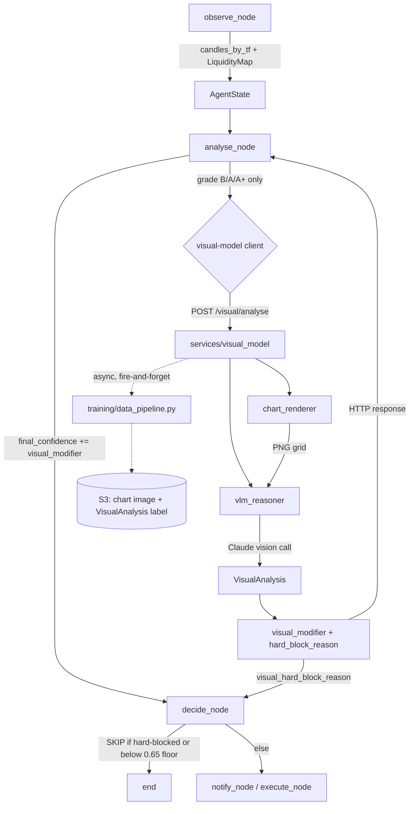
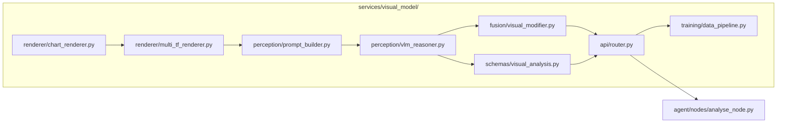
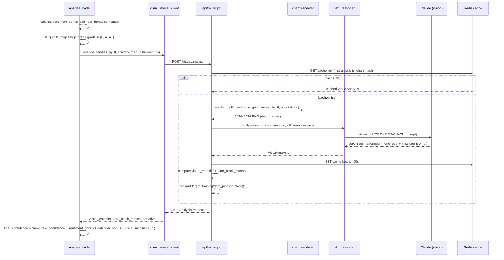
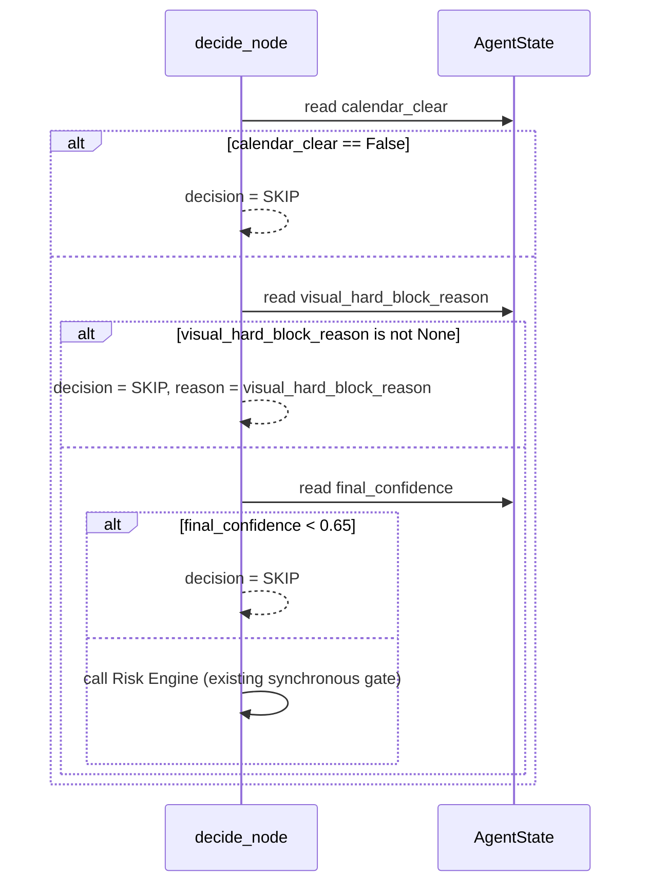

# Design Document:

**spec**: Visual Model (ICT Chart Perception Layer)

## Overview

The Visual Model is a new FastAPI microservice, `services/visual_model/`, that gives the agent a second, independent opinion on a setup by looking at a *rendered chart image* rather than OHLCV numbers. It sends a deterministically-rendered multi-timeframe candlestick grid to a Claude vision-capable model with an ICT-specific prompt, and returns a structured `VisualAnalysis` — a qualitative read on structure cleanliness, CISD displacement dominance, OB/IFVG ambiguity, CRT phase, and fractal coherence.

It runs **in parallel with**, never in place of, `pd_array_engine`'s deterministic `SetupGrader`. The numerical engine still owns setup detection and grading (`SetupGradeDetail`, A+/A/B/NO_TRADE) exactly as designed in `.kiro/specs/pd-array-engine/`. The Visual Model only runs for setups that already clear that bar (grade B or better — see Architecture), and its output does two things downstream, both inside the *existing* agent machinery rather than a new parallel decision system:

1. Contributes a small bounded modifier to `final_confidence`, computed the same way `sentiment_bonus`/`calendar_bonus` already are in `analyse_node` (`.kiro/steering/agent-architecture.md`).
2. Can force a hard `SKIP`, joining the existing gate checks in `decide_node` (`calendar_clear`, Risk Engine) — never bypassing them, never replacing the confidence threshold floor.

This spec covers **Phase 3 only**: prompt-based VLM reasoning against a general-purpose Claude vision model, with zero training data required. Phase 4 (CLIP-style visual embeddings + Visual AlgoRAG) and Phase 5 (fine-tuned ViT, no VLM API call needed) are explicitly deferred — see Non-Goals. This spec's `training/data_pipeline.py` requirement exists only to start *collecting* the self-generated corpus those later phases will need; it does not embed or train anything.

**BRD traceability**: SO-01, SO-03, BR-ML01 (BOS/CHoCH pattern corroboration), BR-ML03 (confidence score per setup), BR-ML04 (multi-timeframe confluence), BR-ML06 (explainable predictions — `visual_insights.narrative`), BR-AG05 (decisions logged with full reasoning).

### Non-Goals (Deferred)

- **AMDX / "X" phase (reversal, retracement)**: not classified by `pd_array_engine.ipda.classifier.classify_crt_phase()` today (it only ever returns `C1_ACCUMULATION`/`C2_MANIPULATION`/`C3_DISTRIBUTION`/`C4_CONTINUATION`/`UNKNOWN`), so the Visual Model scores against exactly that same five-value vocabulary. Neither side invents a phase the other doesn't have. Formalizing reversal/retracement as a real `CRTPhase` value is its own future spec, touching the numerical classifier first.
- **`services/visual_model/perception/clip_embedder.py`, `vit_detector.py`, `training/clip_trainer.py`, `training/vit_finetuner.py`, `training/quality_labeller.py`, and the entire `visual_algorag/` package**: all Phase 4/5. Not scaffolded in this spec. Phase 4 needs ≥500 self-generated, VLM-labelled samples (produced by this spec's `training/data_pipeline.py`) before it's worth building the embedder.
- **pgvector**: not used anywhere on this platform. `services/algorag/` runs on Qdrant (`services/algorag/config.py:14`, 528-dim vectors). When Visual AlgoRAG is eventually built (Phase 4), it targets a Qdrant collection, not a pgvector `ALTER TABLE`.
- **16 instruments / 12 timeframes**: scoped to the 6 instruments `agent/state.py` and `project-conventions.md` actually support today (EURUSD, GBPUSD, USDJPY, XAUUSD, US500, US30) and the 4-timeframe render grid (H4/H1/M15/M5).
- **Modifying `SetupGrader.grade()` or `SetupGradeDetail`'s 8 conditions**: `pd_array_engine/grader/setup_grader.py` stays exactly as specified in the pd-array-engine spec — pure, synchronous, no I/O. The Visual Model is never called from inside it. See Architecture for why.
- **A standalone `fusion/multimodal_scorer.py`-style decision module**: rejected. Visual scoring is folded into the confidence arithmetic `analyse_node` already does, and visual hard-blocks join the gate list `decide_node` already has. One decision pipeline, not two.

---

## Architecture





### Why grading and visual analysis stay in separate processes

`SetupGrader.grade()` is called synchronously and in-process from `pd_array_engine/engine.py:123`, with no I/O anywhere in its call path (`.kiro/specs/pd-array-engine/requirements.md`, Requirement 14.1: "pure Python with no I/O side effects"). A Claude vision call is a network round-trip with multi-second latency and its own failure modes (timeouts, rate limits, malformed JSON). Putting it inside `grade()` would turn a fast, pure, always-succeeds function into one that can hang or fail on a dependency that has nothing to do with candle arithmetic. So the Visual Model is invoked **after** grading, as an enrichment step — structurally the same slot `sentiment_score` (fetched from Redis) and `calendar_clear` (checked against the economic calendar) already occupy in `analyse_node`.

### Why the Visual Model only runs on graded setups, not every candle close

`observe_node` runs `LiquidityMappingEngine.analyze()` on every relevant candle close, but most of those closes don't produce a setup worth trading — `SetupGrader` grades the majority `NO_TRADE` (fewer than 6 of 8 conditions met, Requirement 9.5 in the pd-array-engine spec). Calling the vision API for those would be pure waste — VLM calls are the single most expensive per-inference cost anywhere in this system. `analyse_node` only calls the visual-model client when `state.liquidity_map.setup_grade.grade` is `B`, `A`, or `A+`.

### Why raw candles need to reach `analyse_node`, not just `LiquidityMap`

`observe_node.py` parses `candles_by_tf` out of the incoming Kafka message purely to feed `LiquidityMappingEngine.analyze()` (`agent/nodes/observe_node.py:81-88`) — the parsed dict itself is discarded once `LiquidityMap` is built; only the derived `LiquidityMap` lands on `AgentState` (`agent/state.py:184`). But `chart_renderer` needs the actual OHLCV candles to draw a chart. Re-fetching them independently at `analyse_node` time (from `services/market_data`) risks a subtle bug: price has moved between `observe_node` and `analyse_node`, so the numerical engine and the visual model could end up looking at two different snapshots of "the same" setup. This design instead has `observe_node` retain the already-parsed `candles_by_tf` it built (see Requirement mapping below) so both layers score the identical candle window.

### Package Layout

```
services/visual_model/
├── main.py                        # FastAPI entry point
├── Dockerfile                     # mirrors services/liquidity/Dockerfile pattern
├── requirements.txt
├── config.py                      # thresholds, model names, S3 bucket, Redis TTL
│
├── renderer/
│   ├── __init__.py
│   ├── chart_renderer.py          # single-timeframe OHLCV -> PNG
│   ├── annotation_renderer.py     # overlays PDArray/LiquidityLevel/CISD from LiquidityMap
│   ├── multi_tf_renderer.py       # 2x2 grid: H4/H1/M15/M5
│   └── styles.py                  # colour/size constants
│
├── perception/
│   ├── __init__.py
│   ├── prompt_builder.py          # ICT-specific system+user prompt (CRT + BOS/CHoCH vocabulary)
│   └── vlm_reasoner.py            # Claude vision call, retry-once-on-invalid-json, Redis cache
│
├── schemas/
│   ├── __init__.py
│   ├── visual_analysis.py         # VisualAnalysis Pydantic output schema
│   └── chart_input.py             # request schema: candles_by_tf, LiquidityMap, instrument, timestamp
│
├── fusion/
│   ├── __init__.py
│   └── visual_modifier.py         # VisualAnalysis -> (modifier: float, hard_block_reason: Optional[str])
│
├── training/
│   ├── __init__.py
│   └── data_pipeline.py           # stores chart PNG + VisualAnalysis label to S3; no embedding, no training
│
├── api/
│   ├── __init__.py
│   ├── router.py                  # /visual/analyse, /visual/render, /visual/health
│   └── schemas.py                 # HTTP request/response models
│
└── tests/
    ├── test_renderer.py           # determinism property tests
    ├── test_vlm_reasoner.py       # mocked Claude responses only — never calls the real API in CI
    ├── test_visual_modifier.py    # bounds + hard-block correctness
    └── fixtures/
        └── README.md              # documents how to source real fixtures from the trade journal (MongoDB) — no fabricated trade examples
```

**Deferred, not created in this spec**: `perception/clip_embedder.py`, `perception/vit_detector.py`, `training/clip_trainer.py`, `training/vit_finetuner.py`, `training/quality_labeller.py`, `visual_algorag/` (whole package). See Non-Goals.

**Changed elsewhere in the existing codebase** (not new files, edits to existing ones):
- `agent/state.py` — add `candles_by_tf`, `visual_analysis`, `visual_modifier`, `visual_hard_block_reason`, `visual_narrative` fields to `AgentState`
- `agent/nodes/observe_node.py` — retain the parsed `candles_by_tf` on state instead of discarding it after building `LiquidityMap`
- `agent/nodes/analyse_node.py` — call the visual-model client when grade ≥ B; fold `visual_modifier` into `final_confidence`
- `agent/nodes/decide_node.py` — add `visual_hard_block_reason` to the existing gate checks

---

## Sequence Diagrams

### Setup Enrichment (per graded setup, grade B or better)



### Hard Block at decide_node



---

## Components and Interfaces

### chart_renderer.py

**Purpose**: Deterministic OHLCV → PNG for a single timeframe. Same candle input always produces byte-identical output — required both so the VLM prompt (image bytes feed the cache key) is stable and so Phase 4's AlgoRAG visual similarity is meaningful later.

**Interface**:
```python
def render_single_timeframe(
    candles: List[Candle],
    timeframe: Timeframe,
    annotations: Optional[ICTAnnotations] = None,
    highlight_index: Optional[int] = None,
) -> bytes: ...  # PNG bytes, 512x512
```

**Responsibilities**:
- Exactly 60 candles, dark background (`#0a0a0f`), green/red bodies, no price axis labels, no volume — pattern over precision, per the original design rationale for keeping the model perceiving shape rather than memorizing price levels
- Never touches the network, the database, or any service — pure function over `List[Candle]`

### multi_tf_renderer.py

**Purpose**: Composes four `render_single_timeframe()` calls into the 2×2 grid the prompt describes (top-left H4, top-right H1, bottom-left M15, bottom-right M5).

**Interface**:
```python
def render_multi_timeframe_grid(
    instrument: str,
    timestamp: datetime,
    candles_by_tf: Dict[Timeframe, List[Candle]],
    annotations_by_tf: Dict[Timeframe, ICTAnnotations],
) -> bytes: ...  # PNG bytes, 1024x1024
```

**Responsibilities**:
- Fixed layout, fixed timeframe set (`H4`, `H1`, `M15`, `M5`) — matches the grid the VLM prompt is written against; changing the layout means changing the prompt
- Raises `ValueError` if any of the four timeframes is missing from `candles_by_tf`, so a partial render never silently reaches the VLM with an empty quadrant

### annotation_renderer.py

**Purpose**: Draws `PDArray`, `LiquidityLevel`, `SwingPoint`, and CISD-candle overlays *sourced from the already-computed `LiquidityMap`* — never re-derives them. The whole point of the visual layer is an independent read of the same chart; the annotation boxes exist to orient the VLM's attention (e.g. "here's the OB the numerical engine flagged"), not to hand it the answer.

**Interface**:
```python
def build_annotations(liquidity_map: LiquidityMap, timeframe: Timeframe) -> ICTAnnotations: ...
```

**Responsibilities**:
- Maps `PDArrayType.OB`/`FVG`/`IFVG` to the fill/border styling in `styles.py`
- Maps `LiquidityType.BSL`/`SSL` to horizontal dashed lines
- Highlights the candle at `CISDResult.violation_candle_time` with a gold border

### prompt_builder.py

**Purpose**: Builds the system + user prompt sent to Claude. This is the component that carries the terminology decision from the sync discussion — CRT phases and BOS/CHoCH, not AMD/MSS.

**Interface**:
```python
def build_system_prompt(instrument: str, timestamp: datetime, session: str, kill_zone: str) -> str: ...
def build_user_prompt() -> str: ...  # the 8-section question set, CRT/BOS-CHoCH vocabulary
```

**Responsibilities**:
- Section 1 asks about **BOS** and **CHoCH** (not MSS) on H4/H1, matching `StructureEventType` in `pd_array_engine/models.py:110-114`
- Section 3 asks the VLM to classify each timeframe's phase as exactly one of `C1_ACCUMULATION | C2_MANIPULATION | C3_DISTRIBUTION | C4_CONTINUATION | UNKNOWN` — the same five values `classify_crt_phase()` can return, not the original doc's six-value AMD set
- Sections 2, 4, 5, 6, 7, 8 (dealing range/liquidity, CISD, M5 precision, fractal coherence, quality, visual-numerical divergence) are otherwise unchanged from the original draft — CISD/OB/IFVG/BSL/SSL terminology already matched the codebase from the start
- Requests JSON-only output against `schemas/visual_analysis.py`'s schema, no preamble

### vlm_reasoner.py

**Purpose**: Owns the actual Claude API call, retry-on-invalid-JSON, and Redis caching.

**Interface**:
```python
VISION_MODEL_PRIMARY: str = "claude-opus-5"     # matches services/nlp/llm_service.py's CLAUDE_MODEL pattern
VISION_MODEL_FALLBACK: str = "claude-sonnet-5"  # cost optimisation path

class VLMReasoner:
    async def analyse(
        self,
        chart_png: bytes,
        instrument: str,
        timestamp: datetime,
        session: str,
        kill_zone: str,
    ) -> VisualAnalysis: ...
```

**Responsibilities**:
- Cache key: `sha256(chart_png) + instrument + timestamp.isoformat()`, TTL 60s (same chart within the same minute is never re-analysed)
- On invalid JSON: one retry with an appended "your last response was not valid JSON, return ONLY the JSON object" instruction; on second failure, raises `VLMAnalysisError` (caught by the caller — see Error Handling, never propagates as a 500 that stalls the agent)
- Logs `input_tokens`, `output_tokens`, `model` used per call (cost tracking; VLM calls are the most expensive per-inference cost in the system)

### fusion/visual_modifier.py

**Purpose**: Turns the qualitative `VisualAnalysis` into the two numbers `analyse_node`/`decide_node` actually consume. This is the one piece of "fusion logic" that survives from the original doc's `multimodal_scorer.py` — narrowed to just compute a bounded float and an optional block reason, returned over HTTP, rather than owning the final trade decision itself.

**Interface**:
```python
def compute_visual_modifier(
    analysis: VisualAnalysis,
    numerical_direction: Direction,
) -> Tuple[float, Optional[str]]:
    """Returns (modifier in [-0.15, 0.15], hard_block_reason or None)."""
```

**Responsibilities**:
- `visual_composite = quality.overall_score/10 * 0.5 + fractal.coherence_score/10 * 0.3 + structure.structure_clarity_score/10 * 0.2`
- `modifier = clamp((visual_composite - 0.5) * 0.30, -0.15, 0.15)` — same shape as the original doc's formula, kept as an additive term parallel to `sentiment_bonus`/`calendar_bonus` rather than a multiplicative rescoring of `raw_confidence`
- `hard_block_reason = "visual/numerical direction conflict"` WHEN `analysis.cisd.direction` is not `NONE` and disagrees with `numerical_direction`
- `hard_block_reason = "visual model: {tf} still in C2_MANIPULATION"` WHEN `analysis.crt.m15_phase == "C2_MANIPULATION"` (mirrors the numerical engine's own C2 gating in `classify_crt_phase()` — a setup whose lowest timeframe still reads as manipulation shouldn't be entered regardless of score)
- Never raises — a `VisualAnalysis` that fails to parse into these rules returns `(0.0, None)`, i.e. visually neutral, not a block

### api/router.py

**Purpose**: FastAPI endpoints, mirroring the shape of `services/algorag`'s router.

**Interface**:
```python
POST /visual/analyse   # body: ChartAnalysisRequest -> VisualAnalysisResponse (analysis, visual_modifier, hard_block_reason)
POST /visual/render    # body: ChartRenderRequest -> {image_b64: str}   # debugging / dashboard use
GET  /visual/health    # {status, model_loaded, cache_stats}
```

**Responsibilities**:
- `/visual/analyse` is the only endpoint `analyse_node` calls in normal operation
- On any internal failure (render error, VLM timeout, VLM error after retry), returns `VisualAnalysisResponse(analysis=None, visual_modifier=0.0, hard_block_reason=None, degraded=True)` with HTTP 200, not a 5xx — the agent loop must never break because the vision call failed (see Error Handling)

### training/data_pipeline.py

**Purpose**: Fire-and-forget persistence of every rendered chart + its `VisualAnalysis` label, so a corpus accumulates for Phase 4/5 without any manual work. Does **not** embed or train anything in this spec.

**Interface**:
```python
async def store_training_sample(
    chart_png: bytes,
    analysis: VisualAnalysis,
    instrument: str,
    timestamp: datetime,
    cisd_id: str,
) -> None: ...
```

**Responsibilities**:
- Uploads `chart_png` to S3, records `{s3_key, analysis, instrument, timestamp, cisd_id}` — outcome (`r_multiple`, `outcome`) is attached later by `learn_node` once the trade closes, joined on `cisd_id`, not duplicated here
- Never blocks the `/visual/analyse` response — runs after the response is already sent

---

## Data Models

### VisualAnalysis (schemas/visual_analysis.py)

Restructured from the original draft: `amd` → `crt` (5 values, matching `CRTPhase`), `h1_mss_visible`/`h1_mss_description` → `h1_choch_visible`/`h1_choch_description` (matching `StructureEventType`). Everything else (`structure` H4/H1 BOS, `dealing_range`, `cisd`, `m5_precision`, `fractal`, `quality`, `visual_insights`) is unchanged from the original draft — that vocabulary already matched the codebase.

```python
class CRTPhaseLiteral(str, Enum):
    C1_ACCUMULATION = "C1_ACCUMULATION"
    C2_MANIPULATION = "C2_MANIPULATION"
    C3_DISTRIBUTION = "C3_DISTRIBUTION"
    C4_CONTINUATION = "C4_CONTINUATION"
    UNKNOWN = "UNKNOWN"

class StructureSection(BaseModel):
    h4_direction: Literal["BULLISH", "BEARISH", "RANGING"]
    h4_bos_visible: bool
    h4_bos_description: str
    h1_direction: Literal["BULLISH", "BEARISH", "RANGING"]
    h1_choch_visible: bool
    h1_choch_description: str
    structure_clarity_score: float  # 0.0-10.0

class DealingRangeSection(BaseModel):
    range_visible: bool
    price_position: Literal["PREMIUM", "DISCOUNT", "AT_EQUILIBRIUM"]
    bsl_pools_visible: bool
    bsl_description: str
    ssl_pools_visible: bool
    ssl_description: str
    liquidity_sweep_confirmed: bool
    sweep_description: str

class CRTSection(BaseModel):
    h4_phase: CRTPhaseLiteral
    h4_phase_description: str
    h1_phase: CRTPhaseLiteral
    h1_phase_description: str
    m15_phase: CRTPhaseLiteral
    m15_phase_description: str
    manipulation_complete: bool
    manipulation_evidence: str

class DisplacementCandle(BaseModel):
    visual_dominance: float  # 0.0-10.0
    body_appears_large: bool
    wicks_minimal: bool
    closes_beyond_structure: bool
    description: str

class OrderBlockRead(BaseModel):
    identifiable: bool
    ambiguity: Literal["UNAMBIGUOUS", "MINOR", "SIGNIFICANT"]
    description: str

class IFVGRead(BaseModel):
    visible: bool
    gap_obvious: bool
    ce_approximate: str
    description: str

class CISDSection(BaseModel):
    detected: bool
    direction: Literal["BEARISH", "BULLISH", "NONE"]
    displacement_candle: DisplacementCandle
    order_block: OrderBlockRead
    ifvg: IFVGRead

class M5PrecisionSection(BaseModel):
    ob_visible_at_ce: bool
    ob_ifvg_confluence: bool
    m5_cisd_nested: bool
    description: str

class FractalSection(BaseModel):
    coherence_score: float   # 0.0-10.0
    amd_phases_aligned: bool  # naming kept for continuity with CRT-phase alignment across TFs
    perceived_depth: int      # 1-4 (M15 / M15+H1 / M15+H1+H4 / M15+H1+H4+D1)
    description: str

class QualitySection(BaseModel):
    overall_score: float  # 0.0-10.0
    strongest_element: str
    biggest_weakness: str
    take_this_trade: bool
    conviction_level: Literal["MAXIMUM", "HIGH", "MEDIUM", "LOW", "DO_NOT_TAKE"]

class VisualInsightsSection(BaseModel):
    what_numbers_miss: str
    visual_warnings: str
    narrative: str

class VisualAnalysis(BaseModel):
    instrument: str
    analysis_timestamp: datetime
    structure: StructureSection
    dealing_range: DealingRangeSection
    crt: CRTSection
    cisd: CISDSection
    m5_precision: M5PrecisionSection
    fractal: FractalSection
    quality: QualitySection
    visual_insights: VisualInsightsSection
```

### VisualAnalysisResponse (api/schemas.py — HTTP boundary)

```python
class VisualAnalysisResponse(BaseModel):
    analysis: Optional[VisualAnalysis]   # None only when degraded=True
    visual_modifier: float               # already clamped [-0.15, 0.15]
    hard_block_reason: Optional[str]
    degraded: bool = False               # True on render/VLM failure — agent proceeds numerical-only
```

### AgentState extensions (agent/state.py)

```python
class AgentState(BaseModel):
    ...
    # -- Candle window (new) --
    candles_by_tf: Optional[Dict[str, List[Candle]]] = None
    """Retained by observe_node from the same parse that built liquidity_map, so
    analyse_node's visual-model call scores the identical candle snapshot the
    numerical engine already analysed."""

    # -- Visual analysis (new) --
    visual_analysis: Optional[VisualAnalysis] = None
    visual_modifier: Optional[float] = None
    visual_hard_block_reason: Optional[str] = None
    visual_narrative: Optional[str] = None
```

---

## Confidence Fusion — exact change to `analyse_node.py`

```python
# Existing (agent-architecture.md):
sentiment_bonus = +0.05 if aligned else -0.08
calendar_bonus  = +0.03 if clear else -0.15

# New:
visual_modifier = 0.0
if state.liquidity_map and state.liquidity_map.setup_grade and \
   state.liquidity_map.setup_grade.grade in (SetupGrade.B, SetupGrade.A, SetupGrade.A_PLUS) and \
   state.candles_by_tf:
    visual_result = await visual_model_client.analyse(
        candles_by_tf=state.candles_by_tf,
        liquidity_map=state.liquidity_map,
        instrument=state.instrument,
        timestamp=state.detected_at,
    )
    state.visual_analysis = visual_result.analysis
    state.visual_narrative = visual_result.analysis.visual_insights.narrative if visual_result.analysis else None
    state.visual_hard_block_reason = visual_result.hard_block_reason
    visual_modifier = visual_result.visual_modifier
    state.visual_modifier = visual_modifier

final_confidence = clamp(
    raw_confidence + sentiment_bonus + calendar_bonus + visual_modifier, 0.0, 1.0
)
```

## Hard Block — exact change to `decide_node.py`

```python
# Existing gate order: calendar_clear -> confidence threshold -> Risk Engine
if not state.calendar_clear:
    state.decision = DecisionAction.SKIP
    state.decision_reason = "calendar blackout"
    return state

if state.visual_hard_block_reason:
    state.decision = DecisionAction.SKIP
    state.decision_reason = state.visual_hard_block_reason
    return state

if state.final_confidence is None or state.final_confidence < 0.65:
    state.decision = DecisionAction.SKIP
    state.decision_reason = "below confidence threshold"
    return state

# ... existing Risk Engine synchronous gate, unchanged ...
```

Both new checks sit *after* `calendar_clear` and *before* the confidence floor, consistent with "hard block" meaning: this is checked regardless of how high `final_confidence` ended up.

---

## Error Handling

| Failure | Behaviour |
|---|---|
| Claude vision API timeout/error | `vlm_reasoner` returns after one retry; `api/router.py` catches and returns `degraded=True`, `visual_modifier=0.0`, `hard_block_reason=None` — agent proceeds on numerical score alone |
| Claude returns invalid JSON twice | Same as above — never raises past `api/router.py` |
| `candles_by_tf` missing a required timeframe | `multi_tf_renderer.render_multi_timeframe_grid()` raises `ValueError` before any network call; caught in `api/router.py`, same `degraded=True` response |
| `state.candles_by_tf` absent on `AgentState` (e.g. message didn't carry candle data) | `analyse_node` skips the visual-model call entirely — `visual_modifier` stays `0.0`, no HTTP call made |
| `visual-model` service unreachable (connection refused, DNS) | `visual_model_client` in `agent/` catches the exception, logs, treats as `degraded` — same numerical-only fallback |
| Redis cache unavailable | `vlm_reasoner` calls Claude directly (cache is a cost optimisation, never a correctness dependency) |

**Governing principle**: nothing the Visual Model does can ever turn a would-be `NOTIFY`/`EXECUTE` into a hung request or an unhandled exception. Every failure mode degrades to "numerical engine decides alone," which is exactly today's behaviour before this spec exists.

---

## Testing Strategy

- **Rendering determinism**: property test — same `candles_by_tf` input rendered twice produces byte-identical PNGs (`sha256` equality), consistent with `pd_array_engine`'s own Property 1 (Engine Determinism) pattern.
- **`vlm_reasoner`**: all tests mock the Anthropic client — the real Claude API is never called in CI. Fixture responses cover: valid JSON, invalid JSON once, invalid JSON twice, timeout.
- **`fusion/visual_modifier.py`**: pure-function unit tests — modifier bounds `[-0.15, 0.15]` for the full input range; direction-conflict and `C2_MANIPULATION` hard blocks fire correctly; a `None`/degraded input never raises.
- **Validation fixtures**: the original draft cited two specific dated trades (a USDJPY short, an AUD/USD short) with specific R-multiples as ground truth. Those cannot be verified against this system's actual trade journal from this spec alone, so they are **not** carried forward as fact. Real fixtures should instead be pulled from `learn_node`'s MongoDB trade journal — an actual closed trade with a known `r_multiple` and known chart, so the fixture's expected `quality.overall_score`/`conviction_level` is grounded in a real outcome rather than an assumed one. `tests/fixtures/README.md` documents this sourcing requirement instead of hardcoding invented data.
- **Integration**: `analyse_node`/`decide_node` tests follow the existing pattern in `.kiro/steering/agent-architecture.md` ("inject mock AgentState, assert on output state fields") — inject a `VisualAnalysisResponse` via a mocked `visual_model_client`, assert `final_confidence` and `decision`/`decision_reason`.

---

## Correctness Properties

### Property 1: Chart Rendering Determinism

*For any* `candles_by_tf` input, two calls to `render_multi_timeframe_grid()` with identical arguments SHALL produce byte-identical PNG output.

**Validates**: chart rendering requirement (image consistency for caching and future AlgoRAG similarity).

---

### Property 2: Visual Modifier Bounds

*For any* `VisualAnalysis`, `compute_visual_modifier()` SHALL return a `modifier` in the closed interval `[-0.15, 0.15]`.

**Validates**: fusion requirement (bounded contribution to `final_confidence`).

---

### Property 3: final_confidence Remains Clamped

*For any* combination of `raw_confidence`, `sentiment_bonus`, `calendar_bonus`, and `visual_modifier`, the resulting `final_confidence` computed in `analyse_node` SHALL lie in `[0.0, 1.0]`.

**Validates**: confidence fusion requirement.

---

### Property 4: Direction Conflict Always Blocks

*For any* setup where `VisualAnalysis.cisd.direction` is not `NONE` and differs from the numerical engine's `direction`, `decide_node` SHALL set `decision = SKIP` regardless of `final_confidence`.

**Validates**: hard block requirement.

---

### Property 5: Active Manipulation Always Blocks

*For any* setup where `VisualAnalysis.crt.m15_phase == C2_MANIPULATION`, `decide_node` SHALL set `decision = SKIP` regardless of `final_confidence`.

**Validates**: hard block requirement, mirroring the numerical engine's own C2 gating semantics.

---

### Property 6: Visual-Model Failure Never Raises Past the API Boundary

*For any* internal failure inside `services/visual_model` (render error, VLM timeout, malformed JSON after retry), `POST /visual/analyse` SHALL return HTTP 200 with `degraded=True`, never a 5xx and never an unhandled exception.

**Validates**: Error Handling — the agent loop must never break because the vision call failed.

---

### Property 7: Grading Purity Is Preserved

*For any* `LiquidityMap`, `SetupGrader.grade()`'s output SHALL be identical whether or not `services/visual_model` is running, reachable, or has ever been called — grading has zero dependency on visual analysis.

**Validates**: Architecture decision to keep `pd_array_engine` pure and untouched by this spec.

---

### Property 8: Cache Key Uniqueness

*For any* two distinct `(chart_png, instrument, timestamp)` triples, `vlm_reasoner`'s Redis cache keys SHALL differ; for any identical triple within the 60-second TTL, the second call SHALL NOT invoke the Claude API.

**Validates**: caching requirement (cost control).

---

### Property 9: Visual Model Only Runs on Graded Setups

*For any* `AgentState` where `liquidity_map.setup_grade.grade == NO_TRADE` (or `setup_grade` is `None`), `analyse_node` SHALL NOT call the visual-model client.

**Validates**: cost-control architecture decision (grade-gated invocation).

---

### Property 10: CRT Vocabulary Consistency

*For any* `VisualAnalysis.crt.{h4,h1,m15}_phase`, the value SHALL be one of exactly `{C1_ACCUMULATION, C2_MANIPULATION, C3_DISTRIBUTION, C4_CONTINUATION, UNKNOWN}` — the same five values `pd_array_engine.ipda.classifier.classify_crt_phase()` can return. No `REVERSAL`/`RETRACEMENT`/`CONTINUATION`-as-sixth-value or other AMD-only label SHALL appear.

**Validates**: terminology sync decision (deferred AMDX/X scope).

---

Document: `.kiro/specs/visual-model/design.md`
Status: Draft — awaiting requirements.md and tasks.md
